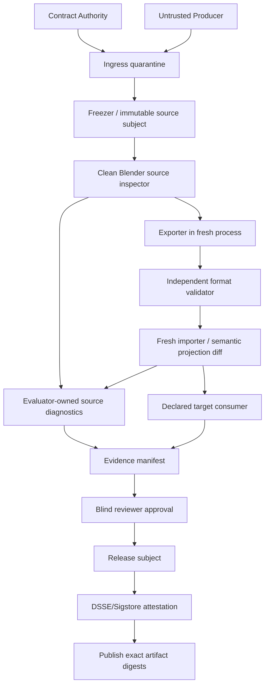

# Blender MCP / Skill 建模产物验收方案 V3.1

## 仓库源码审计、Blender 全目录实测与四次对抗审计

> 审计日期：2026-08-24（Asia/Shanghai）
> 被审仓库：`BlenderDesign`，commit `102a3a2efe8aaf2f7dbdc6dd216f621951812d14`
> 输入方案：`blender_mcp_skill_acceptance_adversarial_audit_v2.md`
> 修订说明：V3.1 纳入 D17～D34 的设计修复，以及 Phase 0 实现复审 D35～D43 的闭环。
> 结论口径：设计级 Critical/High/Medium 与 Phase 0 wrapper 审计发现均已处置；完整 R-1～R10 仍未实现，因此不得宣称生产验收系统已经交付。

---

## 0. 结论先行

V2 的方向正确，但不能直接实现或据此放行资产。首轮对抗审计发现五类结构性问题：

1. G3 要求从导出物搭建 evaluator-owned 场景，但 G4 才导出，门禁顺序自相矛盾；
2. Universal 同时要求独立格式验证、fresh-import 和目标运行时，误伤 `.blend` 原生交付、静帧和 3D 打印等无对应消费者的 Profile；
3. `Waived` 被列为状态，却没有定义它能否满足 `SHIP`；
4. “只读 CAS”没有解决 Producer 与 Verifier 同 UID 时的写入和 TOCTOU；
5. bundle Merkle、artifact manifest、signoff 和 attestation 的覆盖关系未排除自引用，无法形成可计算的最终摘要。

本次 V3.1 已修正上述矛盾，并加入从本仓库真机实测得到的约束：

- runner 必须验证结构化证据中的 `success=true`，不能只看 Blender 进程退出码；
- 每次运行必须使用独占、初始为空的 runtime/evidence/process-registry 根；
- Python、uv、Blender、生成文件和 clean worktree 前置条件必须由同一入口显式建立；
- 工具目录存在不代表工具契约样例有效，必须逐工具运行 known-good、known-bad 和 schema mutation；
- Phase 0 的 `scene_hash` 是结构摘要，不是资产语义身份，禁止进入发布等价判定。

最终状态：

| 对象 | 状态 | 可声明范围 |
|---|---|---|
| 本仓库普通自动门禁 | Pass | 源码、协议、安装器外围合同通过 |
| Phase 0 fail-closed runner + 真 Blender GUI/NFR/recovery | Pass | 精确 Python、vendor、空根、三份 JSON、性能、审计、恢复和进程清理通过 |
| 官方 Blender MCP 固定发行物工具契约 | Pass | 重建 wheel 的 26 项工具目录与 `Scene.frame_current` 代表性成员查询通过 |
| V3.1 方案设计 | Design-ready | 无未处置 Critical/High/Medium 设计缺陷 |
| 通用建模产物验收系统 | Not implemented | 禁止声明 R-1～R10 已实现或可用于发布 |

“没有问题”在本报告中只表示：第四轮结束时，在已实现的 Phase 0 范围与 V3.1 设计中没有发现未处置的 Critical/High/Medium。它不表示有限测试证明了所有 Blender 文件、驱动、GPU、导出器或目标引擎绝对安全。

---

## 1. 审计范围与成功标准

### 1.1 审计范围

本次同时审查三层：

- 当前仓库源码、测试、分发产物和正式文档；
- V2 的信任模型、门禁顺序、状态机、证据闭包和发布条件；
- Blender 5.2.0 LTS 中的真实 UI、Phase 0 Bridge 和官方 Blender MCP 26 个工具。

明确不把以下内容伪装成已完成：

- Unity、Unreal、Godot、Web 或打印切片器的目标消费者测试；
- glTF/USD/FBX 的通用 source↔consumer 等价实现；
- evaluator-owned holdout 渲染器、视觉 Judge 校准集和人工签收系统；
- OS/container 级 Producer/Verifier 隔离；
- 内容寻址资产仓库、DSSE/Sigstore attestation 和发布系统。

### 1.2 成功标准

1. 每个源码能力都归类为 `implemented-and-enforced`、`report-only`、`documented-only` 或 `absent`；
2. 真 Blender 路径必须给出结构化证据，失败不因进程退出码 0 被掩盖；
3. V2 以及后续复审的每个 Critical/High/Medium 设计缺陷都有 V3.1 中唯一、可验证的处置；
4. 第四轮审计不允许遗留未处置 Critical/High/Medium；
5. 未实现能力必须保持 `NOT_IMPLEMENTED`，不能用设计文档代替代码和 E2E。

---

## 2. 仓库源码事实

### 2.1 两条产品链路

当前仓库不是 V2 所描述的通用资产验收系统，而是两条独立链路：

| 链路 | 当前实现 | 权限边界 | 与 V3.1 的关系 |
|---|---|---|---|
| 官方 Blender MCP 分发 | 固定 wheel/extension、安装、verify、rollback | 26 个工具，包含任意 Python | 只能作为不可信 Producer/观察器，不能兼任 Verifier |
| Phase 0 自研通道 | UDS、会话 token、审计、三个只读工具 | 不写场景、不执行 Python | 可提供早期 inventory/health 证据，但不能证明资产语义 |

### 2.2 Phase 0 `scene_hash` 的真实边界

`bridge/core/scene_hash.py` 和 `bridge/blender/scene_reader.py` 明确只覆盖：

- 当前 scene 的对象名、类型、量化 `matrix_world`；
- 数据 RNA 类型；
- Mesh 的顶点、边、面数量。

它不覆盖顶点坐标、拓扑连接、材质/节点、modifier 参数、可见性、collection 归属、相机、灯光、world、动画或外部依赖。V3.1 将其命名为 `phase0_structure_digest`，禁止叫 `semantic_hash`，也禁止用于：

- 跨进程等价；
- source↔export/fresh-import 等价；
- checkpoint 身份；
- 发布 approval 绑定。

### 2.3 自动门禁的真实边界

`bash scripts/checks.sh` 已执行并通过：

- Ruff、strict mypy、插件结构、protocol vendor、嵌套导入；
- 362 个 unit/contract 测试；
- 821 个 distribution 测试通过，1 个条件测试跳过。

合计收集 1,184 个测试，其中 1,183 个通过、1 个条件跳过。额外独立执行：

- Bandit `-ll`：无 Medium/High 发现；
- detect-secrets：0 个发现；
- 三组 pip-audit：0 个已知漏洞；
- 分发 `SHA256SUMS`：四个条目全部匹配。
- `RELEASE=1`：远端 `main` 与锁定 commit 一致；MCP SDK 1.28.1/2.0.0 上游重放通过；两次确定性构建与仓库内五个发行条目逐字节一致。

这些结果不覆盖：

- 任意 `.blend` 的安全或质量；
- V3.1 的资产验收门禁。

### 2.4 类型与静态检查盲区

仓库的 strict mypy 主配置覆盖 `protocol`、`bridge/core` 和 `server`；Blender 适配层被跳过，安装器也只定向检查部分模块。该取舍被大量行为测试补强，但不得把“strict mypy 通过”描述为全仓所有 Python 均严格类型检查。

---

## 3. Blender 全目录实测结果

### 3.1 环境

| 项 | 实测值 |
|---|---|
| Blender | 5.2.0 LTS，build hash `fbe6228777e7` |
| OS | macOS 26.5.2 arm64 |
| 正式 Python | 3.13.13 |
| MCP SDK | 2.0.0（Phase 0 NFR） |
| Git | 最终 Phase 0 测试使用临时验证 commit `5a725009...`、tree `6da63192...` 的隔离 clean worktree；当前交付工作区另有用户未跟踪资产 |

### 3.2 Computer Use 闭环

通过 Computer Use 打开 Blender、关闭欢迎页并在真实 3D 视图执行：

1. 观察默认 Cube 位于 X=0 m；
2. UI 执行 `G → X → 1 → Enter`；
3. 官方 MCP `get_object_detail_summary` 独立读回 X=1.0；
4. UI 执行 Undo；
5. MCP 独立读回 X=0.0；
6. MCP 切换 Scripting workspace 后，Computer Use 截图确认布局改变；
7. 返回 Layout，未保存测试场景。

这证明 UI 动作、Blender 状态和 MCP 观察在该会话中形成了“观察→动作→再观察”闭环；它不证明任意写操作可回滚。

### 3.3 官方 MCP 26 工具

逐项覆盖了 manifest 中 26 个工具，而不是只检查目录名称：

| 类别 | 数量 | 结果 |
|---|---:|---|
| live `.blend` summary | 5 | Pass |
| `_for_cli` 磁盘 snapshot summary | 5 | Pass |
| 对象/collection 详情 | 2 | Pass |
| API/manual 文档 | 3 | Pass；成员查询缺陷已由 0010 patch 修复并回归 |
| 窗口/区域截图 | 3 | Pass，图片实际打开检查 |
| workspace/object 导航 | 4 | Pass；非法 `space_type` 返回结构化 error |
| thumbnail/viewport render | 2 | Pass，PNG 实际打开检查 |
| live/CLI Python 执行 | 2 | Pass；CLI 返回私有 `.blmcp-job-*` snapshot 路径 |

实测发现并已修复的真实缺陷：

原固定发行物中，`get_python_api_docs("bpy.types.Scene.frame_current")` 返回 `kind=partial, found=false`，但同包 `bpy.types.Scene.rst` 明确包含 `.. attribute:: frame_current`。根因是 resolver 找到 `bpy.types.Scene.rst` 后仅搜索尾部 `frame_current`，丢失了 doctree 的 `Scene` 容器层级。

修复：新增下游 `0010-fix-python-api-member-lookup.patch`，先按原 tail 查询，失败时补入父 RST basename 作为 class container；同时新增端到端回归。红测稳定返回 `partial`，修复后在 MCP SDK 1.28.1/2.0.0 均返回 `definition`，原 `bpy.props.IntProperty` 和 typo partial 行为保持通过。固定 wheel、manifest、patch/readme/source-tree hashes 与 `SHA256SUMS` 已确定性重建，`RELEASE=1` 全门禁通过。

当前已启动的旧 MCP Server 进程不会热替换 wheel；上面的 Pass 指仓库内新固定发行物和隔离启动验证。全局安装需通过安装器显式升级并重启 MCP 后才生效。

### 3.4 Phase 0 真机 smoke、NFR 与恢复

`scripts/run_phase0_acceptance.py` 最终 fail-closed workflow 结果：

| 门禁 | 结果 | 关键证据 |
|---|---|---|
| background bpy ping | Pass | `BG_CHECK_OK` |
| GUI timer/revision/fields/hash-scope | Pass | 五项均为 `true` |
| 20 次 GUI session 循环 | Pass | 无线程或 session 目录泄漏 |
| 100k Mesh 场景 | Pass | object/mesh 均 100,000 |
| 100k summary P95 | Pass | 1,318.733 ms < 2,000 ms；max tick 62.303 ms |
| 三工具 60 次调用 | Pass | failed_tools=[] |
| status P95 | Pass | 23.739 ms |
| scene summary P95 | Pass | 1,273.542 ms |
| offline capabilities P95 | Pass | 2.339 ms |
| 审计日志 | Pass | 60 行、60 个唯一 request id |
| kill/restart | Pass | 首实例 `-9`，新实例不同 ID，同一 MCP Server session |
| kill 后错误 | Pass | `BRIDGE_UNAVAILABLE`, retryable=true |
| 进程清理 | Pass | helper、MCP group、registry 全部 clean |

本次会话级结构化诊断证据 SHA-256：

- machine summary：`d3c7fc6194379552d2ab1e42896558839dc0433c6eac45af40dfe432e75d4f20`
- GUI：`e3f30630cf283187b0177e3aa3a5ee8bdf33b0dbef803da8ffc7e605d8ff29bb`
- NFR：`8b84e7dbe72812d0284a883313e7b2b93e603f8703d3ba836d0b2f617ed8ff55`
- recovery：`cc5aab8f0833730472c388323fc428e6a91445234740e330359ad6f85da2bbfb`

这些文件生成在临时测试根中，没有作为仓库发行物持久化；因此上述 hash 只能支持本次审计叙述，不能充当 R9/R10 的可追溯发布证据。

测试驱动与真机迭代中保留的预期 fail-closed 记录：

1. 空 `UV_BIN` 使子进程 argv[0] 为空；证据缺失，NFR Fail，进程组清理成功；
2. clean worktree 未先生成被忽略的 `bridge/_vendor`；provenance Fail；
3. recovery 复用已有 40 条 audit rows 的 runtime root；独占根检查 Fail；
4. Python 3.13.14 替代冻结的 3.13.13；`wrong_python_patch` Fail，未启动 Blender；
5. Blender 嵌入式 Python 在 vendor 根写入 `__pycache__`；封闭目录检查 Fail；
6. GUI/10 万对象通过但 NFR `success=false`；外层整体 Fail 且跳过 recovery。

这些失败没有被当作产品失败，也没有被成功结果覆盖；它们转化为 V3.1 的 runner 前置硬门。

---

## 4. 首轮对抗审计与修复映射

| ID | 严重度 | V2 问题 | V3.1 处置 | 状态 |
|---|---|---|---|---|
| D01 | Critical | G3 使用“冻结导出物”，G4 才导出 | R3 先导出，R4 格式验证，R5 fresh-import，R6 做 source/import 视觉，R7 import 后再做 target 视觉 | Closed |
| D02 | Critical | Merkle、manifest、signoff、attestation 可能自引用 | evidence manifest 排除 approval；release subject 单向引用 evidence+approval；DSSE 只签 release-subject digest | Closed |
| D03 | Critical | 同 UID 只读目录不能阻止 Producer 改证据 | 要求不同 OS principal/容器、不可写 mount；同 UID 仅可标实验级 | Closed |
| D04 | High | Universal 强制所有资产导出/fresh-import/目标引擎 | 按 Artifact Kind + Profile 生成条件门图；`.blend` 原生交付不伪造格式门 | Closed |
| D05 | High | `Waived` 是否满足 SHIP 未定义 | `SHIP` 仅接受 Pass；Waived 只能产生独立 `CONDITIONAL_RELEASE` | Closed |
| D06 | High | N/A 只能建模前声明，但缺少合同变更机制 | 任何 N/A/阈值/Profile 变更产生新 contract digest，并从 R0 全量重跑 | Closed |
| D07 | High | 只看进程非零可能假绿 | runner 同时要求 exit=0、证据存在、schema 完整、`success=true`、hash 匹配 | Closed |
| D08 | High | 证据目录可复用并混入旧记录 | 每个 run 使用新 UUID 根；根必须为空、私有、非 symlink；结束后封存 | Closed |
| D09 | High | G0 在安全打开前要求完整依赖闭包 | R1 只做有界静态/归档检查；R2 clean Blender 枚举后补全闭包 | Closed |
| D10 | High | “semantic hash”没有 coverage 版本与等价投影 | schema/version/coverage 强制入 manifest；每个格式定义可承载字段投影 | Closed |
| D11 | High | 目标运行时被当成通用条件 | 只有合同声明目标消费者时 required；没有消费者时写 `not-applicable-by-contract` | Closed |
| D12 | High | Phase 0 浅 hash 容易被误用 | 明确重命名为 structure digest，禁止参与发布身份 | Closed |
| D13 | Medium | runner 的 Python/vendor 前置依赖本地隐式状态 | R-1 统一自举 exact Python/uv、vendor check、clean provenance | Closed |
| D14 | Medium | 目录存在被当工具正确 | 每个工具执行代表性正/负/边界用例和 schema 漂移检查 | Closed |
| D15 | Medium | 两次 clean-run 比较对象不明确 | 分为 byte、structure、geometry、render 四级确定性，各自阈值明确 | Closed |
| D16 | Medium | 视觉 Reviewer 可能只看 hero 或漏图 | review schema 要求逐 view/pass/frame 明确判定；缺任何 cell 即 Missing | Closed |

---

## 5. V3.1 信任模型



### 5.1 角色与最小权限

| 角色 | 可写范围 | 不得拥有 |
|---|---|---|
| Contract Authority | contract/policy/gate-plan 的签收记录 | Producer 工作区、Verifier evidence、Publisher 凭据 |
| Producer | 自己的工作目录 | contract、golden、Verifier、evidence、publisher 凭据 |
| Ingress/Freezer | 新建 quarantine/CAS object | 修改资产语义、运行候选脚本 |
| Blender Verifier | run 专属 scratch/evidence | Producer 工作区写权、发布凭据、网络默认访问 |
| Format Verifier | 自己的 report scratch | Blender 用户 profile、Producer 插件 |
| Target Consumer | 隔离 target project/cache | 生产账户、Publisher 写权 |
| Reviewer | approval/review record | 资产、阈值、golden、evidence manifest 写权 |
| Waiver Authority | conditional waiver record | SHIP 状态、evidence、普通 approval、Publisher 凭据 |
| Attestor | release-subject attestation | evidence/release subject 写权、Publisher 凭据 |
| Publisher | release CAS promotion | 任意建模/修复能力 |

不同角色至少使用不同 OS principal 或强隔离容器。若只能同 UID 运行，报告必须标记 `isolation_grade=experimental`，不能声称抵御主动恶意 Producer。

R-1 必须从独立受信配置加载并冻结 `trust-policy.json`：允许的 Contract Authority、Reviewer、Waiver Authority、Attestor、Publisher 身份，签名算法/密钥或 OIDC issuer+subject、有效期、撤销/轮换规则、最低 policy version 与防回滚计数器。候选提交、Producer 或 run root 中携带的信任根不得覆盖该策略。

根信任由部署者在 runner 安装/CI 配置中预置，不由本次 evaluation 自证。evaluation 内保存的 policy snapshot 只用于复核；其签名必须回链到该外部根信任。

### 5.2 Blender 不是沙箱

可信读取至少使用：

```text
blender --background --factory-startup --disable-autoexec --offline-mode \
  --python-exit-code 3 checkpoint.blend \
  --python trusted_evaluator.py -- --contract contract.json
```

同时还需要 OS 级断网、无秘密、只读输入、专属输出、CPU/内存/进程/文件/时间限制。`--disable-autoexec`、`--offline-mode` 和 `factory-startup` 都不能替代 OS 隔离。

---

## 6. Artifact Kind 与条件门图

合同先声明 `artifact_kind`，再组合 Profile。R0 必须把两者解析为机器可读的 `gate-plan.json`，按阶段完整枚举 required check/file ID、条件分支、预期产物和执行顺序；runner 只接受已知 schema/ID，每个阶段的实际 ID 集必须与对应计划集合完全相等。Universal 只保留所有交付都适用的证据完整性规则。

| Artifact Kind | required 分支 | 明确不适用 |
|---|---|---|
| `blend_native` | source clean-open、深层 manifest、依赖闭包、source 视觉、offline reopen | R3～R5 export/import 分支；无目标消费者时 target 分支 |
| `interchange` | source + R3 export、R4 独立格式验证、R5 fresh-import 投影、source/import 视觉 | 无合同目标消费者时 target 分支 |
| `runtime_asset` | interchange + R7 指定目标消费者 import/play/render 与 target 视觉 | 无 |
| `rendered_media` | source manifest + 独立媒体解码、帧/色彩/编码/音轨/视觉回归 | 3D fresh-import、几何 projection、target runtime，除非 Profile 另行要求 |
| `fabrication` | source/export + 独立几何验证、单位/尺寸/水密/壁厚检查；声明切片器时执行 R7 | 视觉或切片分支只能由合同明确要求，不能自动假定 |

Profile 仍包括 Static Render、Realtime/Game、Rigged/Animation、Procedural/GN、Simulation/VFX、3D Print、Reference Reconstruction、Marketplace。Profile 只能增加适用规则，不能改变 Universal 证据语义。

Universal 规则缩减为：

- 合同、工具链和身份有 digest；
- 输入有界、不可变、依赖声明可追溯；
- required 检查无 Missing/Crash/Truncated/Not Tested；
- evidence/release-subject digest 与 exact 被验对象闭合绑定；
- runner fail-closed；
- approval 绑定当前 evidence-manifest digest；
- Publisher 只晋级被签 release subject 中列出的 exact artifact digests。

所有跳过分支都必须在 `gate-plan.json` 中带 `NotApplicableByContract` 和理由；不能通过不生成 check 记录来“跳过”。合同、Profile、policy 或工具选择的未知字段一律 Fail，禁止宽松忽略。

门图由 `policy mandatory baseline ∪ Artifact Kind/Profile required ∪ contract additions` 生成。合同只能收紧，不能删除 Universal/policy mandatory 检查；N/A 与 Warning policy 也只能从 policy 允许集合中选择更严格子集。

---

## 7. 修订后的 R-1～R10 门禁

| Gate | 动作 | Required 产物 | 自动失败 |
|---|---|---|---|
| R-1 Trusted bootstrap | 从 run root 外加载受信 runner 与防回滚 trust policy；建新 `evaluation_id` 根；锁基础 Python/uv/Blender；生成并校验 vendor；检查 clean provenance 与时钟 | bootstrap receipt、policy digest、base tool hashes | 信任根来自候选；policy 回滚；隐式解释器；旧 root；生成物缺失 |
| R0 Contract freeze + plan resolution | 验证 Contract Authority；冻结 artifact kind、Profile、export set、projection、预算、视图/帧、warning policy、N/A、publish artifact selection；解析完整门图、工具和资源限制 | signed contract、digest、`gate-plan.json`、各 stage expected check/file ID 集 | 隐式默认、未知/重复 ID 或字段、未授权/过期合同、Producer 可改、计划不闭合、事后选发布 child |
| R1 Ingress quarantine | 为每个 child `run_id` 建空私有非 symlink 根；有界归档/路径/类型检查；拒绝 link/device/bomb；复制到只读 subject staging并冻结 input digest | ingress receipt、byte hashes、run identity | 路径逃逸、资源超限、读取竞态、两个 child 复用根或输入不同 |
| R2 Clean source inspect | 禁 autoexec 的新 Blender 静态/动态清单；完整 reachability、依赖闭包、authored/evaluated manifest | source manifest、coverage、dependency manifest | coverage 缺 required、NaN/Inf、依赖缺失、候选脚本意外执行 |
| R3 Fresh produce/export | 从 R1 exact source 在新进程生成合同交付物（export/render/fabrication output）；前后 source rehash；临时输出原子晋级 | deliverable、producer log、digest | source 改变、输出空、producer/配置漂移 |
| R4 Independent format validate | 按格式加载全部外部资源；检查报告完整性、冻结 warning policy | format report | Error、required warning、Not Tested、truncated、资源未读 |
| R5 Fresh-import equivalence | 第二 clean 进程导入；按合同的可承载字段投影做 source↔import diff | imported manifest、projection diff | 用“都能打开”代替等价；字段超容差 |
| R6 Evaluator-owned source/import visual | 从 source 与 applicable import 建 evaluator-owned 场景；生成 canonical+holdout+diagnostics | 图像、相机/灯光/OCIO manifest | 候选 compositor/world 成唯一证据、缺图、图片未实际解码 |
| R7 Consumer/offline | 对所有 required 交付执行空缓存/断网 reopen；条件执行目标消费者并生成 target manifest/视觉；检查动画/材质/预算 | target manifest/images（条件）、offline receipt | required offline/consumer 未运行；先评 target 后 import；网络补下载；依赖漂移 |
| R8 Repeatability/adversarial | coordinator 至少启动两个独立 normal child，各自在空根执行 applicable R1～R7；冻结相同 input/contract/toolchain digest；另启 negative-fixture child 并比较四级确定性 | child manifests、repeatability、fixture meta-report | 同根/同进程伪重复；输入或工具不一致；只比较“都合法”；known-bad 未按预期失败 |
| R9 Evidence freeze + review closure | 先将 pre-review check/file 集与该 stage expected 集等值校验并生成 evidence manifest；Reviewer 盲审并签该 digest；再校验 post-review expected 集并生成引用二者的 release subject | evidence manifest、approval、release subject | 任一 stage 缺/多/重复 ID；review 先于 evidence 冻结；旧 approval；digest 或 review cell 不匹配 |
| R10 Attest/publish | 依据 R-1 trust policy 验签 release subject、身份/角色/有效期/防回滚和审批；授权 Publisher 再验并按 exact artifact digest 晋级，持久化完成后签 receipt | DSSE attestation、transparency/time proof（按 policy）、Publisher-signed release receipt | 自引用；未知签名者；policy/contract 回滚；重放；发布重新导出；artifact 不一致；未持久化先签 receipt |

R6 只产生 source/import 视觉；target 必须先在 R7 导入后才能生成 target 视觉，消除“先评 target、后运行 target”的顺序矛盾。`blend_native` 等跳过分支由 R0 固化为显式 `NotApplicableByContract` 记录。

`evaluation_id` 是一次验收，`run_id` 是其中一个隔离 child。R8 的两个正常 child 必须共享 input、contract、gate-plan 和 toolchain digest，但拥有不同空根与进程；mutation/known-bad 使用另外的 child，绝不能污染正常 child 证据。

R0 必须在运行前冻结发布选择：要么要求 Byte 级一致，要么预先指定不可变 primary child slot，要么定义唯一 canonicalization。R9 的 release subject 只列出该策略选中的 exact publish artifact digests；其他正常 child 仅作复现证据。禁止看完渲染、评分或文件大小后再选 child。

negative-fixture child 的原始 `Fail`/非零退出必须原样保留；父 coordinator 只有在 fixture identity、预期 failure code 和实际结果完全匹配时，才生成独立元检查 `fixture_rejected=Pass`。不得把 child 的 Fail 改写为 Pass；fixture 意外成功、错误原因不符或证据缺失都使父级 R8 Fail。

---

## 8. 状态机与发布语义

每个检查只能产生：

- `Pass`
- `Fail`
- `Warning`
- `NotTested`
- `NotApplicableByContract`
- `Waived`
- `Crash`
- `Truncated`
- `Missing`

硬规则：

```text
PUBLISH_AUTHORIZED =
  verifier_runner_exit == 0
  AND evidence.success == true
  AND evidence.schema_valid == true
  AND all_pre_publish_stages(actual_check_ids == expected_check_ids)
  AND all_pre_publish_stages(actual_file_ids == expected_file_ids)
  AND all(parent_required_effective_status == Pass)
  AND all(required_files.hash_match == true)
  AND approval.decision == Approve
  AND approval.evidence_manifest_digest == release_subject.evidence_manifest_digest
  AND approval.contract_digest == release_subject.contract_digest
  AND approval.gate_plan_digest == release_subject.gate_plan_digest
  AND approval.review_protocol_digest == release_subject.review_protocol_digest
  AND approval.signature_valid == true
  AND release_subject.artifact_digests == evidence_manifest.digests(gate_plan.publish_artifact_ids)
  AND attestation.subject_digest == digest(release_subject)
  AND signer_and_policy_are_valid == true
  AND publisher_identity_authorized == true

SHIP =
  PUBLISH_AUTHORIZED
  AND post_publish_stage(actual_check_ids == expected_check_ids)
  AND post_publish_stage(actual_file_ids == expected_file_ids)
  AND release_receipt.status == Published
  AND release_receipt.channel == Production
  AND release_receipt.release_subject_digest == digest(release_subject)
  AND release_receipt.artifact_digests == release_subject.artifact_digests
  AND release_receipt.publisher_signature_valid == true
```

- `NotTested`、`Crash`、`Truncated`、`Missing` 永远不满足 required；
- 原始 `observed_status` 永不改写；`Warning` 只有与冻结 policy 的 code、tool version、上下文和上限完全匹配时，才能另记 `disposition=AcceptedWarning`，其门禁有效状态才为 Pass；
- `NotApplicableByContract` 不是运行时状态，只能来自 R0 已签合同；
- 运行后改变 N/A、阈值、Profile 或等价投影必须生成新 contract digest，并从 R0 重跑；
- `Waived` 不满足 `SHIP`。它只能由 trust policy 授权的独立 Waiver Authority 产生签名且机器可区分的 `CONDITIONAL_RELEASE`，其 receipt 必须带 `release_channel=conditional`、绑定 release subject、批准人、期限和补救项；生产 `SHIP` 查询必须始终返回 false；Critical/安全隔离/证据完整性不得 waiver；
- report-only 运行不得进入 R9/R10。

Conditional 分支使用独立的 `CONDITIONAL_PUBLISH_AUTHORIZED` predicate、release subject schema 和发布 channel，不能把 `Waived` 映射成普通 `Approve` 后复用 Production 路径。

集合比较使用 stage-scoped strict set equality，并在比较前拒绝重复 ID、未知字段和 Unicode/路径规范化冲突；pre-review evidence、post-review closure、pre-publish authorization 和 post-publish receipt 使用不同 expected 集，禁止拿尚未生成的 approval/receipt 参与前一阶段闭包。否则删除 required check、伪造同名记录或靠时序缺口都可能假绿。

Verifier coordinator 必须先封存 pre-publish 证据、取得授权 Attestor 的 attestation 并退出；独立 Publisher 只能在 `PUBLISH_AUTHORIZED=true` 后启动。Publisher 发布前重新验证 release subject 与 artifact bytes，持久化完成后才生成 receipt。`SHIP` 是发布后的最终状态，不是 Publisher 的前置输入。

### 8.1 防 Blender 退出码假绿

外层 runner 必须同时检查：

1. 进程退出码为 0；
2. artifact 存在且为普通文件；
3. 大小、字段、JSON 数值和重复 key 合法；
4. `success` 严格为 boolean `true`；
5. 每个 stage 的实际 check/file ID 集与该 stage expected 集严格相等；
6. 所有 required 有效状态为 Pass，同时保留原始 observed status；
7. artifact hash 被 R9 evidence manifest 和 release subject 收录。

日志中的 `SMOKE_OK` 或 `SMOKE_FAIL` 只作诊断，不能作为唯一机器判定。

---

## 9. Semantic manifest 与等价投影

### 9.1 五类摘要

| 摘要 | 用途 |
|---|---|
| byte digest | exact 文件身份 |
| structure digest | 快速 inventory/会话变化；不得冒充语义 |
| semantic Merkle | schema 覆盖字段的内容身份 |
| evidence manifest digest | 输入、导出、依赖、报告和图像的冻结闭包；不含 approval |
| release subject digest | evidence manifest digest、approval digest、交付物 digest、合同/门图/工具链/信任策略身份的发布闭包 |

### 9.2 Manifest required 字段

沿用 V2 对 scene/view layer/collection/object/instance、几何、UV、材质、纹理、modifier/GN、rig/动画、world/render、compositor、cache 和依赖的覆盖，并新增：

- `schema_version` 与 `manifest_coverage`；
- 每个 leaf 的 `source_kind`：authored/viewport/render/export/import/target；
- `unsupported_fields` 和对应合同处置；
- 大数组的 dtype、endianness、quantization、chunk size；
- stable ID 的生成与冲突规则；
- export format 的 `equivalence_projection_version`。

### 9.3 有损格式

source↔import 比较不能要求格式无法承载的字段相同。R0 必须为每种格式冻结：

- 必须保持的字段；
- 可接受变换；
- 明确丢失的字段；
- 数值容差；
- 视觉/运行时替代证据。

未声明的字段丢失不是自动 N/A，而是 Fail。

---

## 10. 视觉协议

保留 V2 的 canonical、holdout、turntable、animation 和 target-runtime 视图，以及 beauty、clay、silhouette、depth、normal、ID、wire 和 alpha pass，但增加三条硬约束：

1. `approval.dsse.json` 的 canonical payload 内含 view×pass×frame 矩阵，每个 required cell 必须有 `opened=true`、图像 hash、判定和缺陷，并同时绑定先前冻结的 evidence manifest、contract、gate plan 和 review protocol digest；
2. source/import/target 的可比视图共享 evaluator-owned camera projection、framing policy、lighting、world、OCIO 和 render settings；
3. holdout challenge 在 R1 input 与 R0 contract digest 都冻结后，由 R-1 policy 指定的不可操纵来源派生（例如 VRF 或未来外部随机信标）；先记录 commitment，R9 evidence freeze 前揭示 seed/proof。seed 不含可由 Verifier 反复重选的 child `run_id`，两个 normal child 共用同一 challenge。Verifier 不能反复抽样择优，Producer 不能在冻结前获知 seed；公开 proof 使结果可复现。

Reviewer 只接收随机化的候选 ID 与 R9 已冻结 evidence；source/import/target 标签是否显示由冻结 review protocol 决定。展示顺序、分配和 unblinding map 由 coordinator 生成并纳入 evidence，Reviewer 签名后才允许解盲，防止选择性展示和身份暗示。

OIIO 的 hard threshold + failing-pixel percentage 仍是像素回归主门；SSIM/LPIPS/VLM 只作诊断。视觉模型不得成为唯一发布批准者。

---

## 11. 确定性定义

禁止只写 `deterministic=true`。分别报告：

| 级别 | 比较对象 | 典型容差 |
|---|---|---|
| Byte | exact artifact bytes | 0 |
| Structure | 层级、数量、标识、依赖图 | 0 |
| Geometry | evaluated positions/normals/UV/bounds | 合同量化/几何容差 |
| Render | diagnostics/beauty | 固定环境的 hardfail+percent |

若流程含时间戳、随机 seed、GPU 非确定性或无序 datablock，必须先规范化或声明该层不可要求 byte deterministic；但 structure/geometry/render 的 applicable 层仍需比较。

---

## 12. Evidence 与 attestation 的非自引用闭包

推荐分四层，把 approval 从其所批准的 evidence manifest 中移出，彻底消除审批自引用：

```text
evaluation/<evaluation_id>/
  policy/                  # 从外部受信源导入的签名、不可变 policy snapshot
  contract/                # signed contract + gate-plan
  runs/<run_id>/           # 至少两个正常 child；mutation child 分离
    inputs/                # immutable source staging
    outputs/               # export/import/target artifacts
    evidence/              # reports/images/logs；不含 approval
  evidence-manifest.json   # 所有 expected raw evidence hash；不含自己/approval
  approval.dsse.json       # Reviewer DSSE payload 绑定上下文 digests + 逐 cell 结论
  release-subject.json     # 引用 evidence/approval/交付物/contract/policy digests
  attestation.dsse.json    # Attestor 签 release-subject digest
  release-receipt.dsse.json # Publisher DSSE payload 记录持久化晋级结果
```

规则：

- `evaluation_id` 与各 `run_id` 都是新 UUID；evaluation 根在 R-1、child 根在 R1 必须不存在或为空；
- evidence manifest 使用稳定排序，按 gate plan expected 集列出 required 文件的规范相对路径、大小、hash 和算法 ID；不包含自身、approval、attestation 或 receipt；
- approval DSSE payload 绑定已存在的 evidence-manifest、contract、gate-plan 和 review-protocol digests，不能要求 evidence manifest 再包含 approval；签名位于 envelope，不进入自身 payload；
- release subject 只引用 evidence-manifest digest、已验证 approval DSSE envelope digest、exact deliverable digests、contract、gate-plan、review-protocol、toolchain 和 trust-policy digest，不包含自身、attestation 或 receipt；
- 所有被 hash/签名的 JSON 都使用冻结的 canonicalization version（例如 RFC 8785 JCS）和 UTF-8；拒绝重复 key、NaN/Inf、未规范 Unicode、绝对/逃逸/碰撞路径；digest 写成带算法与对象域的结构值，禁止不同对象类型共用裸 hash；
- R9 freeze 后把普通文件原子晋级到 Verifier 只读 CAS；R10/Publisher 重新流式计算大小和 hash，拒绝 symlink、device、hardlink 别名及 freeze 后 inode/内容变化；
- attestation 的 DSSE payload 是 release-subject digest 与 predicate type；验签还必须满足 R-1 的身份、角色、有效期、防回滚与重放策略；
- release receipt DSSE payload 引用 attestation、release-subject、evaluation ID、唯一发布事务 ID 和 exact release artifact digests，并记录发布 channel；只能在持久化晋级成功后由 trust policy 授权的 Publisher 签名，envelope signature 不进入自身 payload；
- Producer 无权写 `evidence/`、manifest、approval、release subject、attestation 或 release receipt。

---

## 13. CI 与真实 E2E

### 13.1 最小流水线

1. schema/unit：canonicalization、状态机、projection、Merkle、严格 expected-set equality、路径和资源限制；
2. trusted bootstrap：外部 trust policy、防回滚、exact Python/uv/Blender、vendor、clean provenance、空 evaluation root；
3. contract authority 验签并解析闭合 `gate-plan.json`；
4. 至少两个独立 child 的真 Blender host matrix：支持最小版本、LTS、当前版本和目标 OS；
5. export/independent validator/fresh-import；
6. evaluator-owned source/import visual regression；
7. 条件 target consumer 与 target visual；
8. known-good、known-bad、mutation 和资源耗尽夹具；
9. evidence freeze、blind approval、release subject、attestation、exact-digest publish。

### 13.2 已实现的 Phase 0 入口与剩余边界

`scripts/run_phase0_acceptance.py` 已作为 Phase 0 的 fail-fast wrapper 实现：

- 只接受精确 Python 3.13.13、clean worktree、候选仓库外且不存在的新证据根；
- 清理注入性 Git/Python/Blender/uv/dynamic-loader 环境变量；
- 用同一精确解释器执行 vendor generate/check，再跑 background、GUI/100k/NFR 和 recovery；
- 同时要求子进程 exit=0、0600 普通产物、严格 JSON、schema/mode、`success=true` 和空 registry；
- 对三份 JSON 与五份日志输出大小和 SHA-256 machine summary；超时或中断清理独立进程组。

它没有实现通用 R-1～R10。完整入口仍需从候选目录外读取 trust policy，验证 signed
contract/gate plan，运行两个正常 child 与 mutation，严格比较 stage check/file ID 集，并按
evidence manifest→approval→release subject→attestation→Publisher receipt 闭合。直接运行
`blender --python smoke/runner.py` 仍只作诊断，不能凭退出码称为正式 GUI 验收。

---

## 14. 必须保留的对抗夹具

除 V2 的 arbitrary Python、compositor spoof、six-billboard、hidden 51st object、浅指纹碰撞、材质同名异图、dummy 刷分、render-only modifier、非确定 GN、缺依赖、假动画、关键帧间穿插、格式丢失、validator 截断、Not Tested、fail-open、半写 snapshot、zip slip、TOCTOU、用户配置污染和缺视觉证据外，新增：

| Fixture | 必须捕获 |
|---|---|
| `blender_exit_zero_artifact_fail` | 进程 0 但 artifact `success=false` |
| `reused_evidence_root` | 旧 audit/report 混入新 run |
| `missing_generated_vendor` | clean Git 但运行时生成物缺失 |
| `wrong_python_patch` | 3.13.14 偷代 3.13.13 |
| `tool_contract_member_lookup` | 目录存在但文档声明的成员 identifier 失败 |
| `same_uid_cas_rewrite` | Producer 在 hash 后替换“只读”对象 |
| `attestation_self_reference` | manifest/签名递归不可计算 |
| `approval_self_reference` | approval 绑定包含自身的 manifest，形成不可计算循环 |
| `lossy_projection_undeclared` | 格式丢字段却无 R0 projection |
| `waived_required_gate` | Waived 被错误计入 SHIP |
| `posthoc_na` | 运行后把失败改成 N/A |
| `omitted_required_check` | 删除一个 required record 仍试图 `success=true` |
| `duplicate_or_unknown_check_id` | 重复/未知 ID 混淆集合覆盖 |
| `warning_relabelled_pass` | 原始 Warning 被覆盖成 Pass，审计事实丢失 |
| `repeatability_same_root` | 两次“fresh run”复用根、进程或输入 |
| `target_visual_before_import` | target 尚未导入就伪造 target review |
| `trust_policy_swap_or_rollback` | 候选替换信任根、旧 policy 或旧 contract 重放 |
| `holdout_seed_grinding` | Verifier 多次抽 seed 后只保留有利结果 |

每个 known-bad 的独立 child runner 必须非零并保留明确 failure code；外层 fixture harness 只有在所有预期失败被准确捕获时才返回 0。二者状态不得混用。

---

## 15. 实施优先级

### P0：先让证据不说谎

1. 统一 runner，双判定 exit+artifact；
2. 候选目录外 trust policy、角色验签和防回滚；
3. 独占空 evaluation/child roots；
4. R0 signed contract、Artifact Kind、Profile、projection 与完整 gate-plan schema；
5. expected check/file 集合等值、原始/有效状态和 `Waived`/N/A 语义；
6. Producer/Verifier/Reviewer/Publisher 不同 principal；
7. exact source、dependency 和 evidence hashes；
8. 真 Blender source inspect；
9. fresh export、独立 format validator、fresh-import projection diff；
10. 两个正常 child、known-bad fixtures；
11. evidence manifest→approval→release subject→exact-digest publish。

### P1：生产质量

1. semantic Merkle 与 coverage；
2. authored/viewport/render/export/import/target 分层；
3. evaluator-owned diagnostics 与 holdout；
4. offline dependency reopen；
5. 条件 target consumer；
6. 四级 repeatability；
7. bundle snapshot/restore；
8. DSSE/Sigstore attestation、可信时间/透明日志和密钥轮换演练。

### P2：规模和高风险

1. 多 OS/GPU/driver；
2. 不同 Judge 家族与人工仲裁；
3. hidden benchmark、mutation 和 parser fuzzing；
4. 阈值校准、漂移监控与 golden 独立审批；
5. 大规模 DoS 和目标设备矩阵。

---

## 16. 第三轮对抗审计

第三轮不沿用“第二轮已经清零”的结论，重新从状态机、时序、身份和集合闭包攻击 V3.1，新增缺陷与处置如下：

| ID | 严重度 | 新发现 | V3.1 处置 | 状态 |
|---|---|---|---|---|
| D17 | Critical | approval 若包含在 subject manifest 中又绑定该 subject digest，仍然自引用 | evidence manifest 先冻结且排除 approval；approval 绑定 evidence digest；release subject 再引用两者 | Closed |
| D18 | Critical | DSSE 覆盖 digest，但未定义可信签名者/信任根，攻击者可自签 | R-1 从候选外冻结 trust policy；R10 校验身份、角色、有效期、撤销、防回滚与重放 | Closed |
| D19 | High | R6 要评 target，但 R7 才运行 target consumer | R6 只评 source/import；R7 import 后生成 target manifest/视觉 | Closed |
| D20 | High | R-1 在 R0 知道 artifact kind 前就锁 validator/资源，顺序不可执行 | R-1 只锁受信 bootstrap/base tools；R0 解析完整工具与资源 gate plan | Closed |
| D21 | High | 省略 required record 可能仍满足“现有记录全 Pass” | R0 冻结 expected check/file ID；R9 要求与实际集合严格等值并拒绝重复/未知 ID | Closed |
| D22 | High | R8 的两个 fresh run 与“每 run 单一空根”关系不清 | 引入 evaluation_id + 独立 child run_id；正常与 mutation child 分根、同输入/合同/工具 digest | Closed |
| D23 | High | Artifact Kind 只有文字分支，runner 可静默跳过适用门禁 | R0 必须产出闭合 gate-plan；每个跳过分支显式 NotApplicableByContract | Closed |
| D24 | Medium | allowlisted Warning 直接改 Pass 会丢失原始审计事实 | 分离 immutable observed_status 与 policy disposition/effective status | Closed |
| D25 | Medium | holdout seed 可被 Verifier 多次抽样择优，且“subject 冻结后”时点含糊 | input freeze 后由不可操纵来源 commit/reveal，并记录 proof | Closed |
| D26 | Medium | 会话临时 evidence hash 和当前含未跟踪资产的工作区可能被误写成正式 clean 发布证据 | 明确 clean detached 测试范围，并标注临时 hash 不具 R9/R10 持久性 | Closed |
| D27 | Medium | JSON digest/canonicalization 未冻结，可产生解析器与签名对象歧义 | 冻结 canonicalization version、对象域和算法；拒绝重复 key、非有限数、Unicode/路径碰撞 | Closed |
| D28 | Medium | Reviewer 只绑定 evidence，approval 可被挪到不同合同或审阅协议 | approval 同时绑定 evidence、contract、gate-plan、review-protocol digest | Closed |
| D29 | High | 单一 expected file 集同时包含审批前 evidence 与发布后 receipt，时序上不可满足或会漏检 | gate plan 按 stage 冻结 expected 集；每个 barrier 独立做 strict set equality | Closed |
| D30 | High | 原 SHIP 公式依赖发布结果，却没定义 Publisher 发布前的授权条件 | 拆分 PUBLISH_AUTHORIZED 与发布后 SHIP；receipt 只能在授权后生成 | Closed |
| D31 | Medium | 未签名或提前生成的 release receipt 可伪造已发布状态 | 验证 Publisher 身份；仅在持久化晋级后签包含 evaluation/事务/artifact digests 的 receipt | Closed |
| D32 | Medium | 把 approval/receipt 的签名字段放入其自身签名 body 会再次递归 | 两者使用 DSSE envelope；canonical payload 排除 envelope signatures | Closed |
| D33 | High | known-bad child 必须 Fail，但全局 required 状态必须 Pass，嵌套语义冲突 | 保留 child 原始 Fail；父级仅生成独立 `fixture_rejected=Pass` 元检查 | Closed |
| D34 | High | 两个正常 child 容差内通过但 bytes 不同时，可在结果出来后择优发布 | R0 冻结 byte-equal/primary slot/canonicalization 三选一；R9 只绑定预选 exact artifact | Closed |

修订后再次执行以下反例检查：

| 问题 | 结果 |
|---|---|
| 能否在导出前要求使用导出物？ | 不能；R3→R4→R5→R6 顺序唯一 |
| `.blend` 原生交付是否被迫跑 glTF/目标引擎？ | 不能；Artifact Kind 决定条件门图 |
| Waived 能否悄悄满足 SHIP？ | 不能；只能形成独立 Conditional Release |
| 运行后能否把失败改 N/A？ | 不能；新 contract digest 并从 R0 重跑 |
| 同 UID 的只读目录能否被宣称强隔离？ | 不能；同 UID 只能 experimental |
| attestation 是否需要包含自己的 hash？ | 不需要；evidence/approval/release-subject/attestation 单向分层 |
| approval 能否批准一个包含 approval 自身的 digest？ | 不能；evidence→approval→release subject 单向闭包 |
| approval 能否换绑到另一合同或审阅协议？ | 不能；四个上下文 digest 必须与 release subject 一致 |
| 候选能否自带信任根并自签通过？ | 不能；trust policy 必须来自 run root 与候选之外，并做防回滚 |
| Blender 退出码 0 能否掩盖 artifact Fail？ | 不能；runner 双判定 |
| 能否复用旧 evidence root？ | 不能；R-1 要求新 evaluation 根，R1 要求每个 child 为新空根 |
| 删除 required check 后，剩余项全 Pass 能否放行？ | 不能；actual 与 expected ID 集必须严格相等 |
| 审批前能否被要求提供尚未生成的 receipt？ | 不能；expected 集按 stage 分离并在各 barrier 独立闭包 |
| Publisher 能否在最终判定前自行发布？ | 不能；先满足 PUBLISH_AUTHORIZED，发布及 receipt 完成后才可能成为 SHIP |
| 能否伪造一个未签名 receipt 把授权状态升级成 SHIP？ | 不能；receipt 必须由授权 Publisher 在持久化完成后签名 |
| approval/receipt 的签名是否会覆盖自身签名字段？ | 不会；DSSE signature 位于 envelope，签的是不含 signature 的 canonical payload |
| known-bad 的预期 Fail 会不会被改写成 Pass 或阻断全部验收？ | 不会；child Fail 原样保留，父级验证 exact failure 后产生独立 meta Pass |
| 两个合格 child 的 bytes 不同，能否看完结果再挑一个发布？ | 不能；publish selection 在 R0 冻结，R9 只绑定预选 exact artifact |
| 两次 repeatability 能否复用进程或根？ | 不能；独立 child run_id、空根和进程是 required |
| 能否在 target import 前生成 target 视觉结论？ | 不能；R6 不含 target，R7 import 后才生成 target 证据 |
| 同一 JSON 的不同解析能否产生签名歧义？ | 不能；冻结 canonicalization，拒绝重复 key、NaN/Inf 和规范化碰撞 |
| 工具目录能否代替逐工具功能测试？ | 不能；代表性正/负/边界用例为 required |
| Phase 0 hash 能否证明资产语义等价？ | 不能；明确禁止 |
| 有损格式能否用未声明丢失蒙混过关？ | 不能；projection 未声明即 Fail |
| 缺 target runtime 时能否写“目标可交付”？ | 不能；只能写已实际验证的层级 |

第三轮结果：0 个未处置 Critical、0 个未处置 High、0 个未处置 Medium。

### 16.1 第四轮：Phase 0 实现与真机对抗审计

第四轮不把“设计已闭合”当成实现证据，对新 wrapper 连续执行 unit fixture、clean clone、
Computer Use 可见 Blender、100k/NFR/recovery 和产物重算。发现的问题均先保留失败证据，
再修复并重跑：

| ID | 严重度 | 真机/实现发现 | 修复与回归 | 状态 |
|---|---|---|---|---|
| D35 | High | Blender 退出 0 可携带 GUI `success=false` | GUI 增加 schema/mode/success；外层双判定并以 `blender_exit_zero_artifact_fail` 回归 | Closed |
| D36 | High | 复用 evidence root 可混入旧产物 | 创建前 `lstat`，只接受仓库外、尚不存在的私有根；fixture 保证不启动进程、不触碰旧文件 | Closed |
| D37 | High | clean clone 的 `uv run` 自动选 3.13.14 | runner 精确拒绝非 3.13.13；真实 `wrong_python_patch` 返回 1 且未启动 Blender | Closed |
| D38 | High | clean Git 不包含 ignored `bridge/_vendor` | Blender 前用精确解释器 generate/check，并再次验证 clean provenance | Closed |
| D39 | Medium | Blender 嵌入式 Python 忽略外部禁 pyc 环境，污染 vendor 根 | `bg_check.py` 在项目 import 前禁 bytecode；generator 封闭重建整个 vendor 根 | Closed |
| D40 | High | 调用方环境可用 Git/Python/Blender/uv/dynamic-loader 变量污染子进程 | 建立清洗环境；Git 使用 `/usr/bin/git`；对应注入 fixture 通过 | Closed |
| D41 | Medium | CLI 允许 >100k，但底层 NFR 合同只接受 100k | `--large-objects` 锁定 exactly 100000，并新增边界回归 | Closed |
| D42 | High | 清洗变量后仍保留调用方 PATH，formal provenance 用裸 `git` 可被替换 | 固定系统 PATH 与 `/usr/bin/git`；加入 fake PATH/command 回归并完成真机重跑 | Closed |
| D43 | High | system/global Git config、fsmonitor 或 replace refs 仍可改变 clean/tree 读取 | 禁 system/global config 与 replace objects，关闭 fsmonitor/optional locks；回归检查完整 argv/env | Closed |

最终 clean worktree 真机 run 的五个 stage 均 exit 0；GUI/NFR/recovery 均 `success=true`；
证据与日志为 0600；summary 中八个 SHA-256 全部逐文件重算匹配；recovery registry 和本次
runner 进程组均为空。第四轮结果：在 Phase 0 wrapper 范围内 0 个未处置 Critical、0 个
未处置 High、0 个未处置 Medium。

保留的实现阻塞项不是设计缺陷，仍然阻止生产声明：

- 完整 R-1～R10 Acceptance Runner、semantic manifest、format projection 和 Publisher 尚未编码；
- 当前仓库没有目标引擎 E2E；
- evaluator-owned holdout 和 Reviewer 系统尚未实现。

---

## 17. 最终发布清单

### 身份与运行

- [ ] trust policy 来自候选/run root 外，身份、有效期和防回滚校验通过
- [ ] 新 evaluation root 和每个 child run root 均为空、私有、非 symlink
- [ ] Python/uv/Blender/validator/consumer 精确版本和 hash 已记录
- [ ] clean provenance 与生成文件一致性通过
- [ ] Contract Authority/Producer/Verifier/Reviewer/Waiver Authority/Attestor/Publisher 权限隔离达到合同等级

### 合同与状态

- [ ] Contract Authority 已签 Artifact Kind、Profile、projection、export set、阈值、N/A 和 publish artifact selection
- [ ] gate plan 闭合，每个 stage 的 actual check/file ID 集与 expected 集严格相等
- [ ] required 有效状态全部为 Pass，原始 observed status 未被改写
- [ ] 无 Missing/Crash/Truncated/Not Tested
- [ ] 无把 Waived 计入 SHIP

### 技术与语义

- [ ] source manifest coverage 完整
- [ ] authored/evaluated/export/import/target 层未混淆
- [ ] 依赖闭包与 offline reopen 通过
- [ ] 条件格式验证、fresh-import、target runtime 均按合同执行
- [ ] 至少两个正常 child 使用相同 input/contract/toolchain digest 和不同空根/进程

### 视觉与审阅

- [ ] source/import 使用 evaluator-owned 可比设置；target 视觉只在 target import 后生成
- [ ] canonical/holdout/turntable/动画和 required diagnostics 齐全
- [ ] holdout challenge 的 commitment、seed 和 proof 可验证且无择优抽样
- [ ] 每个 required review cell 均实际打开并绑定图像 hash
- [ ] approval 绑定冻结的 evidence/contract/gate-plan/review-protocol digests，且 Reviewer 身份符合 trust policy

### 证据与发布

- [ ] 进程 exit=0 且 artifact `success=true`
- [ ] canonicalization/算法/对象域一致；重复 key、非法数值与 Unicode/路径碰撞均已拒绝
- [ ] evidence manifest 排除 approval；release subject 仅引用 evidence 与 approval digest，均无自引用
- [ ] approval 与 release receipt 均为 DSSE envelope，canonical payload 不含自身 signature
- [ ] R9 后文件已原子冻结；Publisher 已重新计算普通文件大小/hash 并拒绝链接别名
- [ ] attestation 签的是 exact release-subject digest，身份/有效期/防回滚/重放校验通过
- [ ] Publisher 仅在 `PUBLISH_AUTHORIZED=true` 后执行
- [ ] Publisher 发布 release subject 中的 exact artifact digests，未重新导出或修改
- [ ] post-publish receipt 由授权 Publisher 签名，可反查 evaluation/事务、contract、tools、evidence、approval 和 artifact；Production channel 才可输出 `SHIP`

最终准则：

> 设计文档不是证据，工具目录不是证据，路径不是证据，截图生成也不是审阅。只有统一 runner 对 exact release subject 的完整 expected gate 集、冻结 evidence、当前 approval、可信 attestation 和发布 artifact digest 同时验证通过，才能输出 `SHIP`。
