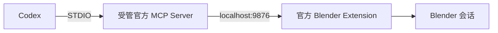
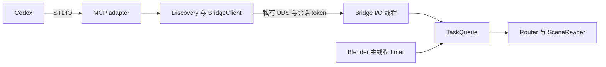

# 项目架构与实现设计

本文是当前实现的唯一总设计，依据源码、测试和发行 manifest 维护，最近核对日期为 2026-09-23。
本文描述组件、数据流和能力边界；安装与现场验收结果由对应运行证据记录。
当前规范与待实施设计分别由[文档中心](README.md)索引；计划中的目标不计入本文的已实现能力。

## 系统组成

BlenderDesign 维护两条独立的 MCP 链路，以及一个尚未闭合通用流程的资产验收核心。

| 组件 | 当前实现 | 边界 |
|---|---|---|
| 官方 Blender MCP 分发 | 固定官方产物、下游补丁、安装器和 live 验证 | 完整工具目录包含任意 Python 执行；依赖本机信任 |
| 自研 Phase 0 | 会话授权的状态与场景摘要读取 | 不提供场景写入、渲染或 Python 执行 |
| 资产验收 | schema v2 的 M0/M1 可信核心及有限 M2 Native/M3 GLB worker | 只覆盖已声明的静态范围，不能用于通用资产自动放行 |

两条 MCP 链路可以并存，但不共享 Server、传输协议或权限模型。资产验收 CLI 是独立入口，
目前没有自动挂接到任一 MCP 链路的建模、保存或发布操作。

## 官方 Blender MCP 分发

`plugins/blender-mcp-installer/` 是 skill-only 安装适配器，插件本身不再启动第二套 Server。
源码入口为 [cli.py](../plugins/blender-mcp-installer/scripts/blender_mcp_installer/cli.py)，
分发合同为 [manifest.json](../plugins/blender-mcp-installer/artifacts/manifest.json)。
官方上游来源、补丁序列、工具清单、平台范围和产物哈希均由该合同记录；
自研项目的 `uv.lock` 与官方 runtime 锁文件分属不同运行环境。

安装器先核验受信提交、作用域和固定产物，再探测宿主及已有受管状态。
受管目标包括 runtime、Blender Extension、用户偏好、Codex 配置及 active selector。
文件与目录操作通过 [filesystem.py](../plugins/blender-mcp-installer/scripts/blender_mcp_installer/filesystem.py)
检查路径、身份和前后镜像；Codex 配置由专用 adapter 合并，避免覆盖无关配置。

| 操作 | 实现行为 |
|---|---|
| `inspect` | 检查宿主、产物、配置和安装状态，不执行安装事务 |
| `install` | 在安装锁内恢复未完成事务并重新检查；目标完全一致时返回 no-op，否则记录日志并切换受管目标 |
| `verify` | 检查受管状态与 Codex 策略，完成 MCP initialize、精确工具目录比对和 Blender 只读调用 |
| `rollback` | 根据 receipt 与目标前后镜像恢复安装前状态；遇到归属或镜像冲突时失败 |

[model.py](../plugins/blender-mcp-installer/scripts/blender_mcp_installer/model.py) 定义 receipt 状态
`prepared`、`installed`、`rollback_pending`、`rolled_back`，并记录每步 action 的进展。
安装器结合 active/pending selector、升级 journal、device/inode 使用锁与恢复副本处理事务中断。
Codex native 注册在私有事务 profile 中执行，验证新 cache 和非目标 TOML 语义后按 cache→config 条件发布。敏感配置快照在写入前绑定受管 stage 身份，配置 stage 可见前另行持久记录 live pre、native post inode/摘要与 cache 的 intent，恢复同一文件而不重跑 native；CODEX_HOME 跨卷时先把同卷事务副本身份追加进 intent 再移入 stage；没有 intent/publication 的 stage 和身份漂移均保留并拒绝。恢复仅续删已记录的目录；旧 runtime、扩展恢复副本和插件 cache 只在新版本现场验证成功并重验归属后删除。当前现场证据、严格 RELEASE 与正常用户 profile 限制见 [验证说明](validation.md#2026-09-23-安装升级当前现场结果)。

真实变更前检查选定 Blender 已退出且目标端口空闲。宿主探测及偏好处理可以使用受控后台进程；
交互式 Blender 由用户正常启动，项目 `.blend` 不属于安装器修改目标。
[verification.py](../plugins/blender-mcp-installer/scripts/blender_mcp_installer/verification.py)
的 live 验证仅调用无参数 `get_blendfile_summary_datablocks`，并在检查前后比较受管目标快照，
收尾时关闭和回收其创建的 MCP 进程。

官方 Extension 的 localhost 端口没有独立鉴权。固定产物和安装完整性校验不构成任意 Python
payload 的沙箱；该链路的信任边界与 Phase 0 的 token 授权不同。

## Phase 0 只读通道

### 工具合同

[server/mcp/adapter.py](../server/mcp/adapter.py) 注册三个工具，并用严格 Pydantic 模型校验结果。
输入 schema 关闭额外字段，调用中间件复核未知参数与标量类型。

| 工具 | 输入 | 输出与行为 |
|---|---|---|
| `get_blender_status` | 可选 `instance_selector` | 实例、版本、连接状态、场景路径与 revision；有限扫描通过 `partial`、`skipped_count` 报告未覆盖部分 |
| `get_scene_summary` | 必需 `instance_id`；两个 include 开关 | 场景名称、路径、单位、计数、collection、受管对象、revision 和结构 hash |
| `describe_capabilities` | 可选 `include_instances` | Server、协议、工具和 Blender 基线；默认不连接 Blender，可离线回答 |

### 会话与请求生命周期

1. 用户在 Blender 的 `Codex` 侧栏允许连接，driver 建立 `BridgeSession` 并注册 timer/handler。
2. Bridge 生成会话 token，建立私有 UDS，原子写入 `session.json`。私有目录使用 `0700`，
   会话文件和 socket 使用 `0600`；socket 路径过长时使用受管短路径。
3. Discovery 有界扫描会话记录，检查所有者、权限、文件与 socket 身份，再探测实例。
   BridgeClient 通过请求 ID、协议版本、结果结构和 deadline 校验往返。
4. I/O 线程接收帧并验证 token，将请求送入队列；Blender 主线程 timer 驱动 Router 和
   `BpySceneReader`，网络线程不读取 `bpy`。断连、取消和过期请求进入清理路径。
5. depsgraph 更新推进 revision；文件加载前推进 generation，使跨 tick 的旧快照失效。
   会话停止按步骤回收连接、回调和其拥有的文件，未完成清理保留重试状态。

对应实现：[lifecycle.py](../bridge/core/lifecycle.py)、[session.py](../bridge/core/session.py)、
[discovery.py](../server/core/discovery.py)、[bridge_client.py](../server/core/bridge_client.py)、
[driver.py](../bridge/blender/driver.py)。

### 传输、资源与审计

[framing.py](../protocol/framing.py) 使用四字节大端长度前缀和 UTF-8 JSON，帧上限为 16 MiB；
Bridge 对请求另设更小的载荷限制。[envelope.py](../protocol/envelope.py) 定义 `ping`、`status`、
`scene_summary`、版本、请求预算和错误码。连接数、队列、待发送字节及摘要并发都有单独上限。

[queue.py](../bridge/core/queue.py) 与 [scene_reader.py](../bridge/blender/scene_reader.py)
以分批生成器推进摘要，限制对象数量和工作集；预算在步骤之间检查。
单次 `bpy` 访问或已进入内核的文件调用不能被这种预算抢占，因此这是协作式限制，
不是任意故障下的绝对墙钟或实时性能保证。

调用中间件记录请求 ID、工具、实例、耗时、参数摘要和错误。
[audit.py](../server/core/audit.py) 写入私有 JSONL 日志，审计不可用时返回 `AUDIT_UNAVAILABLE`，
而非把本次调用报告为成功。默认运行根目录来自当前用户的 `Library/Application Support/BlenderCodex`，
可由 `BLENDERCODEX_ROOT` 指定；目录解析入口为 [config.py](../server/core/config.py)。

### 场景摘要的语义

`scene_hash` 覆盖对象名、类型、量化世界矩阵、数据 RNA 类型及网格顶点/边/面计数。
它不覆盖顶点坐标、拓扑连接、modifier 参数、材质节点、可见性、collection 归属和场景设置。
`scene_revision` 是会话内的更新计数，也不是持久资产标识。因此，单独的 hash 或 revision
不能证明文件完全相同、跨会话等价或视觉一致。定义见 [scene_hash.py](../bridge/core/scene_hash.py)。

## 资产验收核心

独立入口 [scripts/asset_accept.py](../scripts/asset_accept.py) 对 schema v2 合同提供 `freeze`、`run`、`review` 和 `deliver`；证据根须位于仓库外且尚不存在。`acceptance/` 只在 checkout 中使用，不进入 wheel/sdist，也没有注册为 MCP 工具。

[contract.py](../acceptance/contract.py) 封闭加载 schema v2，对合同和运行快照做深不可变处理。[toolchain.py](../acceptance/toolchain.py)、[input_bundle.py](../acceptance/input_bundle.py) 和 [controller.py](../acceptance/controller.py) 分别绑定工具代码闭包、冻结输入与有界子进程结果；[decide.py](../acceptance/decide.py) 是唯一判定归约，[evidence.py](../acceptance/evidence.py) 将 C/S/D/E/V/Q/T 身份封装到封闭证据集。

| 阶段 | 当前实现 | 实际边界 |
|---|---|---|
| M0/M1 | 封闭合同、冻结输入、工具身份、worker 协议、进程资源、唯一判定与 E/V/Q/T | 有限支持的可信核心，不是通用发布批准 |
| M2 Native | 原生检查、重开、参考视觉与有效线框已接线 | 锁定环境的完整门禁为 19 passed/0 failed/0 skipped；范围外能力与业务签收仍未验证 |
| M3 GLB | Validator、逐实例预算、有限表面投影、重开/回导和视觉 worker 已接线；interchange 工具身份在计划、R0、R5 核验 Blender 5.2 glTF 模块闭包 | 最终修复候选的真实三文件门禁为 8 passed/0 failed/0 skipped；与 M2 独立，范围外能力与业务签收仍未验证 |

每个运行都重验合同、冻结输入、工具与交付字节。GLB 计划及 R0/R5 强制核验受支持 Blender glTF 模块树非缓存文件的精确锁定闭包；可选或必需审阅的明确拒收均阻止交付且不改写技术 V。测试 reviewer 只验证流程，不代替真实业务签收；未知平台、范围外资产或缺失证据保持失败关闭。

## 模块与分发边界

| 目录 | 职责 |
|---|---|
| `protocol/` | framing、envelope、错误码；不依赖 `bpy` |
| `bridge/core/` | 会话、队列、路由、生命周期与抽象 SceneReader；不依赖 `bpy` |
| `bridge/blender/` | `bpy` 适配、UI、timer/handler 与场景读取 |
| `bridge/_vendor/` | 由 `scripts/vendor_protocol.py` 生成的协议副本 |
| `server/core/`、`server/mcp/` | 配置、发现、客户端、审计与 MCP SDK adapter |
| `acceptance/` | checkout-only 的 schema v2 资产验收核心及 M2 Native/M3 GLB worker；有限门禁不等于通用发布放行 |
| `plugins/blender-mcp-installer/` | 独立官方分发、安装器和操作技能 |
| `smoke/`、`scripts/`、`tests/` | 构建与验证入口、诊断、unit/contract/distribution 测试 |

[pyproject.toml](../pyproject.toml) 的 wheel/sdist 包范围只有 `protocol`、`bridge`、`server`。
样例 `.blend`、PNG、计划和审计记录不参与安装器信任链，也不会因存在于仓库而成为运行时输入。

## 验证依据

各设计合同对应的测试入口如下；具体执行结果以绑定提交和环境的验证记录为准。

| 设计合同 | 测试入口 |
|---|---|
| 会话授权、队列与恢复 | `tests/unit/test_session.py`、`test_lifecycle.py`、`test_queue.py`、`test_driver.py` |
| 协议、MCP 往返与取消 | `tests/unit/test_framing.py`、`test_adapter.py`、`tests/contract/` |
| 摘要范围、失效和资源边界 | `tests/unit/test_scene_hash.py`、`test_scene_reader.py` |
| 资产验收核心、Native 与 GLB worker | `tests/unit/test_asset_v2_*.py`、`test_native_*.py`、`test_interchange_*.py`、`tests/integration/test_asset_*.py` |
| 安装事务、恢复、升级清理与 live 合同 | `tests/distribution/test_cli.py`、`test_filesystem.py`、`test_upgrade_workflow.py`、`test_registration_staging.py`、`test_verification.py` |

自动化完整门禁、runtime 发行门禁、Phase 0 正式现场验收和官方 live 验证分别见
[验证说明](validation.md)。磁盘状态、单元测试和现场连通性属于不同证据；
正式 Phase 0 验收也不替代通用资产验收。Agent 执行约定由 [AGENTS.md](../AGENTS.md)
维护，设计文档不额外增加安装、发布或场景操作授权。
