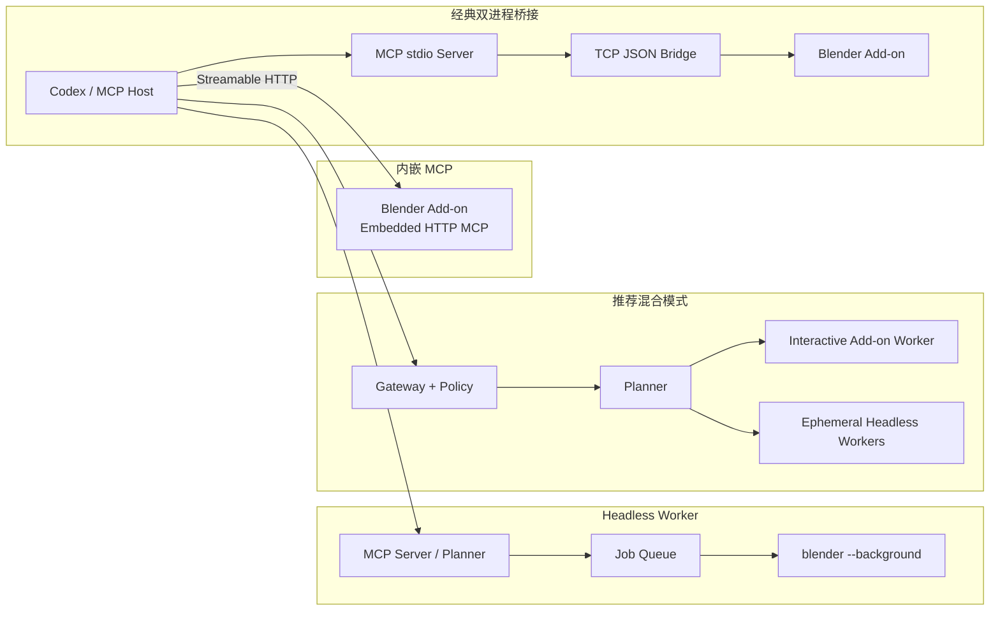
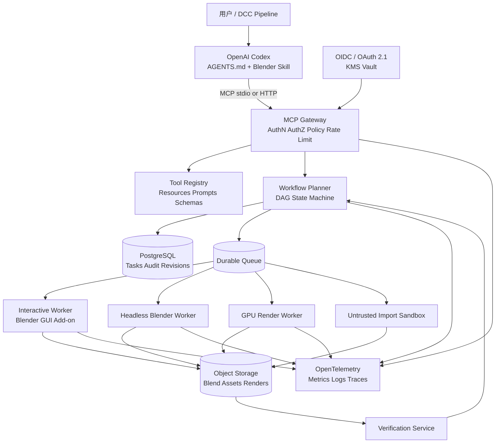
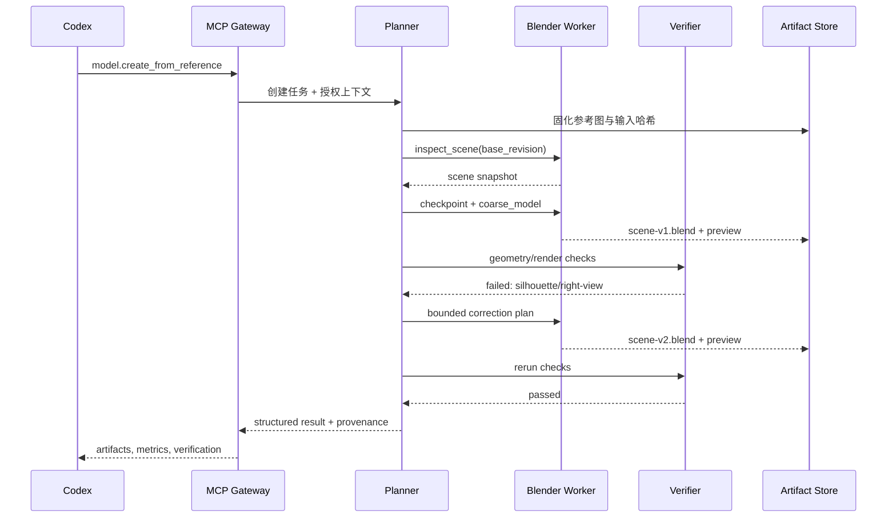
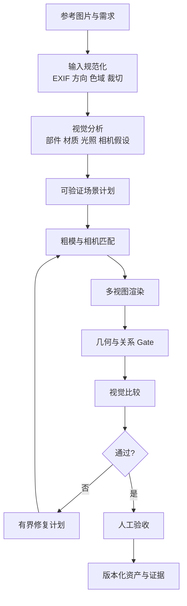

# 生产级 Blender AI Skill 深度研究报告（外部研究输入）

> **文档状态：已整合、已审计，但不是项目规范或已验证事实清单。**  
> 来源：`/Users/yeminjie/Downloads/deep-research-report-2.md`，整合日期：2026-08-07。  
> 原文中的 `turn…` 内部引用占位符无法由仓库读者复核，整合时已移除；原文主张并未因此自动获得背书。  
> 已核验的事实修正、代码缺陷、许可证边界与适配建议见 [对抗性审计与优化建议](../audits/2026-08-07-plan-adversarial-audit-and-optimization.md)。

**研究主题：** 基于 OpenAI Codex、Model Context Protocol 与 Blender Python API 的自动化建模系统  
**资料检索截止：** 2026 年 8 月 6 日  
**目标平台：** macOS 交互式工作站、Linux Headless/Kubernetes 渲染与自动化集群  
**目标等级：** 长期维护、可扩展、稳定、安全、可审计，而非单机演示

## Executive Summary

生产级 Blender Agent 的核心问题并不是“如何让模型执行一段 `bpy` 代码”，而是如何把一个高度有状态、依赖主线程和 UI Context、可能执行任意本机代码的桌面应用，改造成具有**稳定契约、任务隔离、事务恢复、权限边界、审计链和自动验证**的 Agent 执行环境。

本报告的核心结论如下。

| 决策点 | 推荐结论 |
|---|---|
| 总体架构 | 采用 **Codex Skill → MCP Gateway → Task Planner → Blender Worker**，而不是 Codex 直接连接单个 Blender Add-on |
| Blender 执行 | GUI 交互任务使用 Add-on 主线程命令队列；渲染、烘焙、导入高风险资产和批处理使用独立 Headless Worker |
| Tool 策略 | 采用 **少量公开复合 Tool + 动态发现的原子 Tool + 受控 Planner 接口**；默认不要向模型暴露数百个平铺 Tool |
| Python 执行 | `python.execute` 只能作为隔离容器中的 break-glass 能力；默认禁用，不能依赖 Python 黑名单构成安全沙箱 |
| 一致性 | 每个写操作带 `base_revision`、`idempotency_key`、`transaction_id`；以 `.blend` 快照和命令日志实现恢复，不依赖 Blender Undo 作为持久事务 |
| 并发 | 一个场景只允许一个写租约；只读分析可以基于不可变快照并行运行 |
| 长任务 | 渲染、模拟、Geometry Nodes Bake、资产生成统一建模为异步 Task，支持状态、进度、取消、超时和产物 URI |
| 参考图复刻 | 视觉模型只负责提出假设；最终验收必须由几何测量、场景断言、轮廓/深度/法线和渲染回归共同完成 |
| MCP 版本 | 新系统应面向 **MCP 2026-07-28** 的无状态核心；任务和业务会话状态应外置，不能继续假定 HTTP 连接等于 Session |
| 开源基线 | 最值得吸收的是 `blender-ai-mcp` 的分层 Tool/确定性验证、`blend-ai` 的主线程队列和工程测试、`dcc-mcp-blender` 的渐进式 Skill、`sandraschi/blender-mcp` 的 Headless 模式 |
| 不建议直接用于生产 | `ahujasid/blender-mcp` 可作为生态和原型参考；`6xvl/blender-mcp` 的强制自动更新与安装期修改代码模式不适合作为企业供应链基线 |
| Codex Skill | Skill 不应只是提示词，而应包含 `SKILL.md`、`AGENTS.md`、工作流、Tool 选择策略、错误恢复规则、验证标准、脚本和版本兼容矩阵 |

截至检索日，MCP 最新正式规范为 `2026-07-28`，其重要变化包括无握手、无传输层 Session 的无状态核心、基于 HTTP Header 的路由、可缓存 Tool/Prompt/Resource 列表、授权强化和正式扩展机制。这意味着许多仍以 `Mcp-Session-Id` 或长连接内存状态为基础的现有 Blender MCP 项目，需要增加兼容层或进行协议升级。

OpenAI 官方把 Codex Skill 定义为包含说明、资源和可选脚本的可复用能力包，并通过 `AGENTS.md` 为仓库提供持久运行规则；官方对长任务的建议是维护计划文件、里程碑、验证证据和持续更新的任务状态，而不是让 Agent 在单次上下文中隐式记忆整个流程。Codex 的 Agent Loop 本身会组合用户输入、仓库指令、工具定义和 MCP Tool，因此 Blender Skill 的操作规则必须与 Tool Schema 一起设计。

截至检索日，OpenAI 公共模型文档将 GPT-5.3-Codex 描述为当前最强的 Agentic Coding 模型，并支持图像输入、Function Calling 与 Structured Outputs；但生产系统应固定模型快照、维护评测基线，并避免把流程正确性绑定到某一模型别名。

## 官方基线与关键技术约束

**Blender 的首要约束是执行线程，而不是 MCP Transport。** Blender 官方明确指出 Python Thread 并非受支持的 Blender API 执行方式，后台线程在脚本结束后继续运行可能导致随机崩溃；适合并行的独立计算应优先使用多进程。公开项目普遍因此让 Socket/HTTP 线程只负责收包，再通过 `bpy.app.timers` 或专用 Dispatcher 把 `bpy` 操作送回主线程。

`bpy.ops` 是面向用户操作和 UI 状态的 Operator API，执行结果依赖当前模式、活动对象、选区、窗口、Area、Region 和 View Layer；`poll()` 失败、Context 不正确和 Headless 缺少 UI 区域是 Agent 自动化中最常见的不稳定来源。数据块创建、变换、材质、Mesh 和 Node Tree 操作应优先通过 `bpy.data`、RNA 属性与 BMesh 完成，只把无法合理替代的 UI 操作留给 Operator，并显式构造 Context Override。

Blender Headless 模式使用 `--background`，渲染参数的顺序会影响最终行为；动画、单帧、引擎和线程都可从命令行控制。它适合确定性批处理、集成测试、渲染、导入导出和物理烘焙，但依赖可见 `VIEW_3D` 的截图、交互式 Sculpt 或部分 OpenGL 操作不能假定在 Headless 环境可用。

Asset Browser 中的 Asset 本质上是附加了资产元数据的数据块，Asset Library 则是注册到 Blender Preferences 的目录。生产系统不应只返回磁盘路径，而应维护资产 ID、来源、License、版本、哈希、单位、坐标系、依赖纹理和导入策略，并将其映射到 Asset Browser Catalog。

Geometry Nodes 可通过 `BlendDataNodeTrees.new(..., type="GeometryNodeTree")` 创建 Node Tree；节点、Socket 和 Link 均可通过数据 API 操作。由于节点类型、Socket 名称和接口 API 会随 Blender 版本变化，生产 Tool 应采用逻辑节点模板与版本适配器，而不是让模型直接猜测 `bl_idname`、Socket 索引和版本相关名称。

Blender 4.2 之后的 Extension 包以 ZIP、`blender_manifest.toml` 和 Add-on 代码组成，可通过命令行完成 build、validate 和 install。扩展还应尊重 `bpy.app.online_access`；企业环境应在 Add-on 层把离线模式和网络策略作为强制约束，而不是只依赖 UI 偏好。

MCP 中 Tool、Resource 和 Prompt 分工应清晰：Tool 表达有副作用或计算动作，Resource 表达可读取状态，Prompt 表达可复用工作流指导。Tool Server 必须验证输入、实现访问控制、限流和输出净化；客户端还应对敏感调用进行确认、设置超时并记录审计日志。

对于 HTTP Transport，授权应遵循 MCP 的 OAuth 授权模型和资源绑定；stdio 通常从受控环境获取凭据，不应把 HTTP OAuth 流程机械套到子进程 Transport。新规范还要求关注发行者校验、受众绑定和避免 Token Passthrough。

长任务不应把一个 `tools/call` 阻塞几十分钟。MCP Tasks 已规定任务 ID 的授权绑定、不可猜测性、TTL 和列表暴露风险；即使客户端尚未完整支持最新 Tasks 扩展，也应提供等价的 `job.submit/status/cancel/result` 契约。

## 开源仓库深度分析与比较

下图归纳了当前 Blender MCP 项目的主要技术路线。



### 仓库综合对比

| 仓库 | 定位与链路 | Tool 设计 | 安全、长任务与恢复 | 测试与运维 | License 与生产判断 |
|---|---|---|---|---|---|
| `ahujasid/blender-mcp` | 最流行的原型基线；MCP stdio Server → localhost TCP → 单文件 Add-on → `bpy` | 少量高级 Tool 加 `execute_blender_code`，后者具有完整 Python 能力 | 默认架构缺少企业级认证、事务和隔离；公开安全报告曾指出任意代码执行和路径读取风险；代码已出现后续修复活动，但 raw execution 本质风险不变 | 仓库规模和社区最大，生态价值高；GUI/本地连接导向明显 | MIT。适合学习、Demo、个人工作站和兼容性基线，不宜原样进入多租户生产。 |
| `djeada/blender-mcp-server` | stdio MCP → JSON/TCP `127.0.0.1:9876` → Add-on；约 27 个 Tool、7 个命名空间 | 原子 Tool 为主，附加同步/异步 Python、Job API 和脚本库 | 提供 Safe Mode、路径根限制、模块阻止、Command Allowlist、异步 Job；重任务可转 Headless | 有 `tests/`、Dockerfile、CI、脚本库和 Mocked `bpy` 测试；结构比单文件方案清晰 | MIT。适合作为中小型内部工具或二次开发起点；仍需补认证、持久任务、快照事务和真实 Blender E2E。 |
| `glonorce/Blender_mcp` | stdio Bridge → 长度前缀 TCP `9879` → Dispatcher → 52 个 Handler → `bpy.app.timers` | 69 个 Tool Group、550+ Action；Intent Router 按任务筛选；同时保留 raw code | Safe/High Mode、参数校验、异步 Job Manager、主线程调度、BVH 场景检查；同步渲染被阻止并改用子进程 | 宣称 499 个单测，模块分层完整；但公开历史只有 1 个提交，难以判断演进过程和审查质量 | MIT。设计资料丰富，适合借鉴 Dispatcher、验证和工具发现；单提交历史是显著维护与供应链风险。 |
| `6xvl/blender-mcp` | 基于经典桥接方案；约 270 个直接分发 Tool | 大量平铺原子 Tool，追求减少每次 Python 生成 | 强制自动更新，从主分支替换 Add-on 和已安装 Server 文件；缺少默认 opt-out | 公开历史仅 8 个提交；一键 `curl | bash` / PowerShell 安装并修改 site-packages | MIT。功能面广但供应链、可重复部署、Schema 选择准确率和回滚风险高，不建议作为生产底座。 |
| `HoldMyBeer-gg/blend-ai` | stdio MCP → 长度前缀 TCP → Background Socket → 主线程 Timer Queue | 164 个 Tool、24 个模块、12 个 Prompt；领域原子 Tool + 少量高级材质构建 | Localhost、输入校验、Command/Node Allowlist、Render Guard、Keepalive；raw code 采用黑名单式限制 | 106 次提交；1190 个测试，CI 覆盖 Ubuntu/macOS/Windows 与多 Python 版本；结构、安装和扩展打包较成熟 | AGPL-3.0-or-later。工程质量在本地方案中较强，但 AGPL 合规、单连接、无 MCP 事务和黑名单“沙箱”仍需处理。 |
| `PatrykIti/blender-ai-mcp` | FastMCP Server → Goal Router → JSON-RPC/TCP → Blender Add-on 主线程 | 明确的 Atomic/Macro/Workflow 分层；默认只暴露搜索优先的小型 Guided Surface | 强调确定性测量和 Assertion、参考图 Gate、版本化 Surface；提供 stdio 与所谓 stateful Streamable HTTP | Clean Architecture、E2E、Docker、Prompt/Tool 文档与质量 Gate 较完整 | Apache-2.0。理念最接近生产 Agent；但其“stateful Streamable HTTP”表述需升级到 MCP 2026-07-28 无状态核心。 |
| `sandraschi/blender-mcp` | 默认由 Server 启动 `blender --background`；可选 GUI Bridge；含 Dashboard/Tauri | 约 41–48 个 Portmanteau Tool，内部覆盖 150–170+ Operation | Headless 优先，支持 Prometheus、Docker 和每 Tool 覆盖执行模式；也存在脚本类和外部生成式服务能力 | Ruff、Mypy、Pytest、Bandit/Safety、MCPB 和 Web Dashboard；项目面较广，复杂度较高 | MIT。适合作为 Headless、批量和 CI 模式参考；需收缩攻击面并拆分核心 Worker 与外围 UI。 |
| `dcc-mcp/dcc-mcp-blender` | MCP Streamable HTTP Server 内嵌 Blender；GUI 用主线程 Dispatcher，Headless 用 Blocking Dispatcher；可接 DCC Gateway | 200+ Tool 与渐进式 Skill Catalog，支持 search/describe/load-skill | 嵌入式 HTTP 简化部署但扩大 Blender 进程爆炸半径；需要在外层 Gateway 做认证、租户隔离和限流 | 发布、CLI、Skill Catalog、E2E 与跨 DCC 体系较成熟；公开 Transport 仍注明兼容 MCP 2025-03-26 | 源码仓库标注 MIT；实际扩展发布包需单独核对。适合借鉴 Progressive Skill 与 DCC Gateway，不建议把公网入口直接放进 Blender 进程。 |

### 各仓库关键源码落点

下表以“需要审计和借鉴的代码落点”代替大段逐字复制；其中路径来自仓库公开结构，实际采用前必须固定 Commit SHA 后重新检查。

| 仓库 | 建议重点阅读的源码与配置 |
|---|---|
| `ahujasid/blender-mcp` | `addon.py`：Socket Server、Command Handler、raw Python 和第三方资产服务；`src/blender_mcp/server.py`：FastMCP Tool 与 TCP Client；`src/blender_mcp/__init__.py`：入口；`main.py`：启动；`pyproject.toml`：依赖；`TERMS_AND_CONDITIONS.md`：遥测与服务条款。 |
| `djeada/blender-mcp-server` | `addon/`：Command Queue、Handler 和 Job Manager；`src/blender_mcp_server/`：stdio MCP 与工具定义；`scripts/library/create_mesh.py`：数据 API 模式；`scripts/library/camera.py`、`keyframes.py`、`save_blend.py`：可复用受控脚本；`tests/`：Mocked `bpy`；`Dockerfile` 和 `.github/workflows/`：构建链。 |
| `glonorce/Blender_mcp` | `stdio_bridge.py`；`blender_mcp/dispatcher.py`；`core/protocol.py`；`core/thread_safety.py`；`core/execution_engine.py`；`core/parameter_validator.py`；`core/security.py`；`core/intent_router.py`；`core/semantic_memory.py`；`core/job_manager.py`；`handlers/manage_scene_comprehension.py` 与 `manage_rendering.py`。 |
| `6xvl/blender-mcp` | `addon/blender_mcp_addon.py`；`server/server.py`；`docs/tools_blender_mcp.md`；`install.sh`、`install.ps1`；`sync.ps1`；`VERSION`；重点审计启动时自动更新与对已安装包的覆盖逻辑。 |
| `blend-ai` | `src/blend_ai/server.py`；`connection.py`；`validators.py`；`tools/`、`resources/`、`prompts/`；`addon/server.py`；`addon/dispatcher.py`；`thread_safety.py`；`render_guard.py`；`handlers/`；`blender_manifest.toml`。 |
| `blender-ai-mcp` | `server/`：FastMCP Surface；`server/router/`：Goal、Safety、Workflow、Session Context；`blender_addon/`：RPC 与主线程调度；`ARCHITECTURE.md`；`_docs/TOOLS/`；Prompt Library；Vision Layer 文档；Surface Profile 与合同版本配置。 |
| `sandraschi/blender-mcp` | `src/blender_mcp/server.py`；`handlers/`；`tools/`；`utils/`；Headless 启动和 GUI Bridge；`run_server.py`；`docker-compose.yml`；Prometheus 接入；`webapp/`、`native/`；`mcpb.json`；CI 与审计配置。 |
| `dcc-mcp-blender` | `BlenderMcpServer`；`SkillCatalog`；`ActionRegistry`；HTTP Handler；`BlenderUiDispatcher`；Headless `BlockingDispatcher`；Gateway 注册与动态端口发现；CLI 的 `search`、`describe`、`load-skill` 和调用统计路径。 |

### 可借鉴和应避免的实现模式

经典项目的主线程桥接可以抽象为：

```python
# 等价化示意，不是某仓库逐字源码
socket_thread:
    request = receive_length_prefixed_json()
    future = main_thread_queue.submit(request)
    response = future.result(timeout=request.timeout)
    send_length_prefixed_json(response)

def timer_pump() -> float:
    for _ in range(MAX_COMMANDS_PER_TICK):
        command = queue.get_nowait()
        execute_with_bpy(command)
    return 0.01
```

该模式正确解决了 Socket 线程不得直接操作 `bpy` 的问题，但必须补上队列长度上限、Deadline、取消、请求去重、场景写锁、Timer 丢失检测以及 Blender 文件加载后重新注册。`blend-ai`、`glonorce` 和 `dcc-mcp-blender` 都体现了不同形式的主线程 Dispatcher；`blend-ai` 还为渲染状态增加了 Guard。

大型 Tool Catalog 的正确方向不是把 200–500 个 Schema 全部塞进模型上下文，而是提供 `search_tools`、`describe_tool`、`load_skill` 或按 Intent 过滤。`glonorce` 使用 Tool Tier 与意图过滤，`blender-ai-mcp` 默认提供很小的 Guided Bootstrap Surface，`dcc-mcp-blender` 使用渐进式 Skill Catalog；三者都比 `6xvl` 的数百 Tool 平铺方式更接近生产实践。

raw Python 黑名单不能构成可靠安全边界。Python 的反射、对象图、已加载模块、Blender 数据驱动器、文件 Handler、表达式和第三方 Add-on 都可能绕过简单的 Import/Builtin 黑名单。`blend-ai` 的限制能减少误调用，但仍应被视为“危险功能的风险降低”，而不是容器隔离的替代。`ahujasid/blender-mcp` 的公开安全问题则说明了把 LLM 控制的字符串直接交给 `exec()` 和文件 API 的实际风险。

## Tool 设计与 Blender 执行模型

### 推荐的 Tool 分层

生产系统应维护三个 Tool 层级，但只让 Codex 默认看到第一层。

| 层级 | 可见性 | 典型 Tool | 设计目标 |
|---|---|---|---|
| 任务级 Tool | 默认可见，约 12–25 个 | `scene.inspect`、`model.create_from_reference`、`material.build`、`lighting.setup`、`camera.compose`、`animation.create`、`render.submit`、`asset.import`、`verify.run` | 对应用户意图，减少 LLM 规划步数和选择错误 |
| 原子 Tool | 动态发现，按 Skill/领域加载 | `object.create`、`mesh.extrude`、`node.add`、`node.connect`、`keyframe.insert`、`material.assign` | 精确、可组合、容易测试，但不应一次全部暴露 |
| Planner/Workflow | 受控入口 | `workflow.plan`、`workflow.execute`、`workflow.resume`、`workflow.rollback` | 执行有界 DAG，提供检查点、补偿和完整审计 |
| Break-glass | 默认不可见 | `python.execute_sandboxed`、`operator.invoke_raw` | 仅限管理员、临时 Worker、人工确认与完整录制 |

`scene.list_objects`、`object.create`、`material.assign` 和 `render.execute` 这类原子接口适合做内部实现；用户层更适合 `configure_product_shot`、`create_turntable_animation`、`prepare_asset_for_gltf` 和 `reconstruct_reference_stage`。Patryk 项目的 Atomic/Macro/Workflow 分层与 Goal-first Router 是目前公开项目中最清晰的参考。

所有 Tool 必须返回机器可读的 Structured Result，而不是只返回自然语言，例如：

```json
{
  "request_id": "req_01J...",
  "transaction_id": "txn_01J...",
  "status": "succeeded",
  "scene_revision_before": 41,
  "scene_revision_after": 42,
  "changed_entities": [
    {"id": "obj_f1c...", "name": "ChairSeat", "kind": "MESH"}
  ],
  "warnings": [],
  "artifacts": [],
  "verification": {
    "passed": true,
    "checks": ["object_exists", "bbox_within_tolerance"]
  },
  "metrics": {
    "queue_ms": 4,
    "blender_ms": 38
  }
}
```

### 推荐 JSON Schema

```json
{
  "$schema": "https://json-schema.org/draft/2020-12/schema",
  "title": "object.create",
  "type": "object",
  "additionalProperties": false,
  "required": ["kind", "name", "idempotency_key", "base_revision"],
  "properties": {
    "kind": {
      "enum": ["cube", "sphere", "cylinder", "mesh_asset"]
    },
    "name": {
      "type": "string",
      "minLength": 1,
      "maxLength": 128,
      "pattern": "^[^/\\\\\\x00]+$"
    },
    "transform": {
      "$ref": "#/$defs/transform"
    },
    "collection_id": {
      "type": ["string", "null"]
    },
    "base_revision": {
      "type": "integer",
      "minimum": 0
    },
    "transaction_id": {
      "type": ["string", "null"]
    },
    "idempotency_key": {
      "type": "string",
      "minLength": 16,
      "maxLength": 128
    },
    "dry_run": {
      "type": "boolean",
      "default": false
    }
  },
  "$defs": {
    "vec3": {
      "type": "array",
      "prefixItems": [
        {"type": "number"},
        {"type": "number"},
        {"type": "number"}
      ],
      "items": false
    },
    "transform": {
      "type": "object",
      "additionalProperties": false,
      "properties": {
        "location": {"$ref": "#/$defs/vec3"},
        "rotation_euler_rad": {"$ref": "#/$defs/vec3"},
        "scale": {"$ref": "#/$defs/vec3"}
      }
    }
  }
}
```

MCP Tool Schema 应同时声明 `inputSchema` 和 `outputSchema`；`readOnlyHint`、`destructiveHint`、`idempotentHint` 和 `openWorldHint` 可以辅助客户端，但规范明确这些 Annotation 只是提示，不能代替服务端授权和策略。

推荐的 Tool 元数据还应包括：

```yaml
x-blender:
  capability: scene.write
  risk: medium
  execution_mode: main-thread
  timeout_class: interactive
  retry_policy: idempotency-key-only
  scene_lock: write
  snapshot_policy: before-first-write
  supported_blender:
    min: "4.2"
    tested: ["4.2-lts", "4.5-lts", "5.x"]
```

### 三种执行方案比较

| 方案 | 优点 | 主要缺陷 | 适用范围 |
|---|---|---|---|
| MCP 直接执行 Python | Tool 少、覆盖整个 `bpy`、原型最快 | 任意代码执行；Schema 弱；难以审计实际影响；Context/线程问题由模型承担；无法可靠判断幂等性 | 本机可信开发、实验、紧急诊断 |
| MCP → Add-on → Command Queue → `bpy` | 符合主线程约束；用户可在 GUI 看到结果；易实现局部状态检查 | 单 Blender 进程故障域；长任务会阻塞；Timer/File Load 恢复复杂；并发控制有限 | 交互建模、艺术家协同、短时修改 |
| MCP → Task Planner → Blender Worker | 可隔离、扩缩容、持久任务、审计、重试和资源配额；支持 Headless | 架构和运维复杂度最高；需维护状态数据库、队列、产物存储和版本矩阵 | 生产推荐方案、CI、渲染农场、多项目与复杂流程 |

最终推荐并不是完全舍弃 Add-on，而是将 Add-on 作为一种 **Interactive Worker Adapter**。Planner 根据任务特点选择：

```text
需要观察 Viewport / 用户当前选择 / 交互式调整
    → Interactive Blender Add-on Worker

渲染 / Bake / 导入不可信资产 / 批处理 / 参考图迭代
    → Ephemeral Headless Blender Worker

无法由稳定 Tool 表达的特殊任务
    → Isolated Break-glass Worker，执行后销毁
```

### 事务、恢复与并发

Blender Undo/Redo 面向交互式操作历史，依赖 Operator、Context 和 Undo Stack，不能等价为数据库事务。生产系统应采用以下组合：

| 机制 | 作用 |
|---|---|
| `scene_revision` | 乐观并发控制，拒绝基于过期场景状态的写入 |
| Scene Lease | 每个场景同一时刻只有一个 Writer |
| `.blend` Checkpoint | 在工作流首写、危险操作和里程碑前保存副本 |
| Command Journal | 记录 Tool、规范化参数、调用者、结果、对象变更和哈希 |
| Idempotency Store | 相同业务键重复到达时返回原结果，不重新创建对象 |
| Compensation | 对可逆动作定义删除、恢复属性或回滚快照 |
| Worker Fencing Token | 已失去租约的旧 Worker 无法提交新版本 |
| Artifact Manifest | 记录纹理、缓存、Alembic、USD、渲染和外部依赖 |

只有只读操作和明确声明幂等的操作可自动重试。写操作发生超时后不能直接假设“没有执行”；应先查询 `request_id` 或命令日志，再决定返回原结果、继续等待或从快照重建。

## 推荐的生产级 Blender AI Skill 架构



**Codex Skill 层**负责把 Blender 操作规范变成持久能力：何时先检查场景、如何选择 Macro/Atomic Tool、何时创建 Checkpoint、哪些动作需要人工确认、验证失败后允许几次修复、何时停止。Skill 还应包含版本兼容表和故障手册，而不是让这些知识只存在于模型 Prompt 中。OpenAI 的 Codex Skill 和 `AGENTS.md` 设计正适合承载这种仓库级运行约束。

**MCP Gateway 层**是唯一对 Codex 暴露的网络边界。它完成 OIDC/OAuth、租户和项目解析、Tool Capability 授权、Schema 校验、速率限制、预算控制、Header 路由和审计。不得把 Blender 内嵌 HTTP Server 直接暴露到企业网络或公网。

**Planner 层**把高层请求编译成有界 DAG，例如：



**状态必须外置。** MCP 2026-07-28 的核心是无状态的，每个请求可被任意实例处理；因此 Scene Revision、Goal、Workflow Step、参考图、Task、权限上下文和幂等记录应位于 PostgreSQL、对象存储和队列，而不是某个 FastMCP 进程的内存 Session。现有项目中的 Goal Session 可以继续作为应用概念，但不能依赖传输连接存活。

**认证与授权模型**建议采用 Capability RBAC/ABAC：

| Capability | 示例权限 |
|---|---|
| `scene.read` | 场景图、对象属性、预览图 |
| `scene.write.basic` | 创建、变换、材质和相机 |
| `scene.write.destructive` | 删除、应用 Modifier、重拓扑、清空场景 |
| `asset.import.trusted` | 从内部资产库导入 |
| `asset.import.untrusted` | 只能进入隔离 Worker |
| `render.submit` | 提交有限规格渲染 |
| `render.gpu` | 使用 GPU 队列 |
| `code.execute` | Break-glass，需审批 |
| `filesystem.export` | 只能写入授权 Artifact Namespace |

**审计事件**至少包含主体、租户、项目、场景 ID、Tool 名、Schema 版本、规范化参数哈希、授权决策、模型和 Codex Run ID、Worker 镜像、Blender 版本、Add-on Commit、输入/输出 Artifact 哈希、场景 Revision、耗时、资源消耗和验证结果。日志中应对 Prompt、文件路径、API Key、参考图和商业资产元数据进行分级与脱敏。

**Secret 管理**方面，生产环境使用 KMS/Vault 和短期凭证；本地 macOS 工作站可使用 Keychain。第三方生成式 3D 服务的 API Key 不应保存在 `.blend` 自定义属性、Add-on Preferences 明文或 Prompt 中。

**资源隔离**方面，每个 Headless Worker 使用只读根文件系统、临时工作目录、非 root 用户、seccomp/AppArmor、CPU/内存/Ephemeral Storage 限额和默认拒绝 Egress。只有明确需要访问内部 Asset Registry 或渲染许可证服务的任务才开放目标地址。GPU Worker 应以独立队列和配额管理。

**可观测性**应贯穿 `MCP request_id → workflow_id → task_id → worker_id → render_id`。关键指标包括 Tool 成功率、Schema 拒绝率、队列等待、主线程执行延迟、Blender 崩溃率、Worker OOM、渲染耗时、重复请求命中率、验证首轮通过率和每个成功资产的平均 Agent 修复轮数。

## 实现模式与部署清单

### Codex Skill 目录建议

```text
skills/blender-production/
├── SKILL.md
├── AGENTS.md
├── schemas/
│   ├── scene-inspect.schema.json
│   ├── workflow-plan.schema.json
│   ├── render-submit.schema.json
│   └── verification-result.schema.json
├── prompts/
│   ├── reference-reconstruction.md
│   ├── asset-preflight.md
│   └── failure-recovery.md
├── workflows/
│   ├── product-shot.yaml
│   ├── reference-model.yaml
│   ├── turntable-animation.yaml
│   └── gltf-export.yaml
├── policies/
│   ├── tool-selection.md
│   ├── destructive-actions.md
│   ├── filesystem.md
│   └── quality-gates.md
├── scripts/
│   ├── compare_renders.py
│   ├── inspect_blend.py
│   └── validate_artifacts.py
└── compatibility/
    └── blender-matrix.yaml
```

`AGENTS.md` 可规定：

```markdown
# Blender production rules

- Always inspect the scene and read its revision before a mutation.
- Prefer workflow or macro tools over atomic tools.
- Never invoke raw Python unless the task explicitly authorizes break-glass mode.
- Create a checkpoint before destructive geometry, file load, bake, or import.
- A task is not complete until deterministic verification passes.
- Do not infer geometry correctness from a screenshot alone.
- On timeout, query the request or task status before retrying.
- Stop after two bounded repair iterations and return blockers with evidence.
```

Codex 长任务应把 Workflow Plan、完成条件和验证结果写入可持久文件或任务数据库，使重新连接或模型切换后能够继续执行。OpenAI 官方对长时 Agent 任务强调以计划和里程碑作为事实来源，并在每个阶段运行验证。

### MCP Tool 实现示例

```python
from __future__ import annotations

from dataclasses import dataclass
from typing import Any
from uuid import UUID

from pydantic import BaseModel, Field, ConfigDict


class CreateObjectInput(BaseModel):
    model_config = ConfigDict(extra="forbid")

    kind: str
    name: str = Field(min_length=1, max_length=128)
    base_revision: int = Field(ge=0)
    idempotency_key: str = Field(min_length=16, max_length=128)
    transaction_id: UUID | None = None
    dry_run: bool = False


class ToolResult(BaseModel):
    request_id: UUID
    status: str
    scene_revision_before: int
    scene_revision_after: int
    changed_entities: list[dict[str, Any]]
    warnings: list[str] = []
    verification: dict[str, Any]


@dataclass(frozen=True)
class RequestContext:
    subject_id: str
    tenant_id: str
    project_id: str
    capabilities: frozenset[str]


async def create_object(
    args: CreateObjectInput,
    ctx: RequestContext,
    planner: "PlannerClient",
) -> ToolResult:
    if "scene.write.basic" not in ctx.capabilities:
        raise PermissionError("Missing scene.write.basic")

    # Planner owns idempotency, scene locking, checkpointing and audit.
    return await planner.submit_short_operation(
        operation="object.create",
        payload=args.model_dump(mode="json"),
        subject_id=ctx.subject_id,
        tenant_id=ctx.tenant_id,
        project_id=ctx.project_id,
    )
```

MCP Server 不应在 Tool 函数中直接打开 Socket 并调用 Blender。Tool Handler 只负责身份、Schema、策略和提交任务；真正的执行生命周期属于 Planner。

### Blender 主线程 Dispatcher

```python
from __future__ import annotations

import queue
import time
from concurrent.futures import Future
from dataclasses import dataclass
from typing import Callable, Any

import bpy


@dataclass
class BlenderCommand:
    request_id: str
    deadline_monotonic: float
    fn: Callable[[], Any]
    future: Future[Any]


class MainThreadDispatcher:
    def __init__(self, max_queue_size: int = 256) -> None:
        self._queue: queue.Queue[BlenderCommand] = queue.Queue(
            maxsize=max_queue_size
        )
        self._running = False

    def submit(
        self,
        request_id: str,
        timeout_seconds: float,
        fn: Callable[[], Any],
    ) -> Future[Any]:
        future: Future[Any] = Future()
        command = BlenderCommand(
            request_id=request_id,
            deadline_monotonic=time.monotonic() + timeout_seconds,
            fn=fn,
            future=future,
        )
        self._queue.put_nowait(command)
        return future

    def _pump(self) -> float | None:
        if not self._running:
            return None

        # Bound each tick to preserve UI responsiveness.
        for _ in range(8):
            try:
                command = self._queue.get_nowait()
            except queue.Empty:
                break

            if command.future.cancelled():
                continue

            if time.monotonic() > command.deadline_monotonic:
                command.future.set_exception(TimeoutError("Queue deadline exceeded"))
                continue

            try:
                result = command.fn()
            except BaseException as exc:
                command.future.set_exception(exc)
            else:
                command.future.set_result(result)

        return 0.01

    def start(self) -> None:
        if self._running:
            return
        self._running = True
        if not bpy.app.timers.is_registered(self._pump):
            bpy.app.timers.register(self._pump, first_interval=0.01)

    def stop(self) -> None:
        self._running = False
```

还需要在 `load_post`、新建场景和 Factory Reset 后验证 Timer 是否仍注册。Timer Pump 的 Readiness 不应只检查 TCP 端口，而要提交一个无副作用 Probe 并确认主线程实际执行成功。

### 数据 API 封装

```python
import bpy
from mathutils import Vector


def create_mesh_object(
    *,
    name: str,
    vertices: list[tuple[float, float, float]],
    faces: list[tuple[int, ...]],
    collection: bpy.types.Collection,
) -> bpy.types.Object:
    if name in bpy.data.objects:
        raise ValueError(f"Object already exists: {name}")

    mesh = bpy.data.meshes.new(f"{name}_Mesh")
    try:
        mesh.from_pydata(vertices, [], faces)
        mesh.validate(verbose=False)
        mesh.update(calc_edges=True)

        obj = bpy.data.objects.new(name, mesh)
        collection.objects.link(obj)
        return obj
    except Exception:
        bpy.data.meshes.remove(mesh, do_unlink=True)
        raise
```

此类封装比 `bpy.ops.mesh.primitive_*` 更容易在 Headless、测试和非活动对象环境中复现。需要 Edit Mode 拓扑处理时，优先把 Mesh 转成 BMesh，完成后更新并释放。BMesh 是 Blender 官方提供的底层 Mesh 编辑 API。

### 异步 Worker 模式

```python
async def execute_task(task: BlenderTask) -> TaskResult:
    lease = await scene_locks.acquire(
        scene_id=task.scene_id,
        owner=task.worker_id,
        ttl_seconds=60,
    )

    try:
        await lease.start_heartbeat()

        if task.requires_checkpoint:
            checkpoint = await snapshots.create(
                scene_id=task.scene_id,
                base_revision=task.base_revision,
            )

        process = await launch_blender_subprocess(
            blend_path=checkpoint.path,
            worker_script="/app/worker_entry.py",
            task_manifest=task.manifest_path,
            timeout_seconds=task.timeout_seconds,
            network_policy=task.network_policy,
        )

        result = await process.wait_and_collect()

        if result.exit_code != 0:
            raise BlenderWorkerError(result.stderr)

        verification = await verifier.verify(result.artifacts)
        if not verification.passed:
            return TaskResult.needs_repair(result, verification)

        return await scene_store.commit(
            expected_revision=task.base_revision,
            artifacts=result.artifacts,
            fencing_token=lease.fencing_token,
        )
    finally:
        await lease.release()
```

### Dockerfile 示意

```dockerfile
FROM ubuntu:24.04

ARG BLENDER_VERSION
ARG BLENDER_ARCHIVE_SHA256

RUN apt-get update && apt-get install -y --no-install-recommends \
      ca-certificates curl xz-utils \
      libx11-6 libxext6 libxrender1 libxi6 libxfixes3 \
      libgl1 libegl1 libsm6 libice6 \
    && rm -rf /var/lib/apt/lists/*

RUN useradd --create-home --uid 10001 blender

WORKDIR /opt
COPY blender-${BLENDER_VERSION}-linux-x64.tar.xz /tmp/blender.tar.xz
RUN echo "${BLENDER_ARCHIVE_SHA256}  /tmp/blender.tar.xz" | sha256sum -c - \
    && tar -xf /tmp/blender.tar.xz \
    && mv blender-* blender \
    && rm /tmp/blender.tar.xz

COPY --chown=blender:blender worker/ /app/
USER blender

ENV HOME=/home/blender \
    PYTHONUNBUFFERED=1 \
    BLENDER_USER_CONFIG=/tmp/blender-config \
    BLENDER_USER_SCRIPTS=/tmp/blender-scripts

ENTRYPOINT ["/opt/blender/blender", "--background", "--factory-startup", "--disable-autoexec", "--python", "/app/worker_entry.py", "--"]
```

镜像中应固定 Blender 二进制哈希、Worker Commit、Add-on 包和 Python 依赖锁文件；不要在容器启动时拉取主分支或自动覆盖代码。

### Kubernetes Worker 示意

```yaml
apiVersion: batch/v1
kind: Job
metadata:
  name: blender-task-01jxyz
  labels:
    app: blender-worker
    tenant: tenant-a
spec:
  backoffLimit: 0
  activeDeadlineSeconds: 3600
  ttlSecondsAfterFinished: 1800
  template:
    metadata:
      labels:
        app: blender-worker
        network-profile: isolated
    spec:
      restartPolicy: Never
      serviceAccountName: blender-worker
      automountServiceAccountToken: false
      securityContext:
        runAsNonRoot: true
        runAsUser: 10001
        fsGroup: 10001
        seccompProfile:
          type: RuntimeDefault
      containers:
        - name: blender
          image: registry.example/blender-worker@sha256:...
          args:
            - "--task-manifest"
            - "/task/task.json"
          resources:
            requests:
              cpu: "2"
              memory: "8Gi"
              ephemeral-storage: "10Gi"
            limits:
              cpu: "8"
              memory: "24Gi"
              ephemeral-storage: "40Gi"
          securityContext:
            allowPrivilegeEscalation: false
            readOnlyRootFilesystem: true
            capabilities:
              drop: ["ALL"]
          volumeMounts:
            - name: task
              mountPath: /task
              readOnly: true
            - name: work
              mountPath: /work
      volumes:
        - name: task
          projected:
            sources:
              - configMap:
                  name: blender-task-01jxyz
        - name: work
          emptyDir:
            sizeLimit: 40Gi
```

```yaml
apiVersion: networking.k8s.io/v1
kind: NetworkPolicy
metadata:
  name: blender-worker-deny-egress
spec:
  podSelector:
    matchLabels:
      app: blender-worker
  policyTypes: ["Ingress", "Egress"]
  ingress: []
  egress:
    - to:
        - namespaceSelector:
            matchLabels:
              name: artifact-services
      ports:
        - protocol: TCP
          port: 443
```

GPU Worker 应使用专用 Node Pool、RuntimeClass 和 Device Plugin，并以渲染分辨率、采样数、帧数和预计显存为调度输入。

### systemd 服务示意

```ini
[Unit]
Description=Blender MCP Gateway
After=network-online.target
Wants=network-online.target

[Service]
Type=simple
User=blender-agent
Group=blender-agent
WorkingDirectory=/opt/blender-agent
EnvironmentFile=/etc/blender-agent/gateway.env
ExecStart=/opt/blender-agent/.venv/bin/python -m blender_agent.gateway
Restart=on-failure
RestartSec=3
TimeoutStopSec=20
NoNewPrivileges=true
PrivateTmp=true
ProtectSystem=strict
ProtectHome=read-only
ReadWritePaths=/var/lib/blender-agent /var/log/blender-agent
RestrictAddressFamilies=AF_UNIX AF_INET AF_INET6
LockPersonality=true
MemoryDenyWriteExecute=true

[Install]
WantedBy=multi-user.target
```

macOS 的交互式 Add-on 通常应由 Blender UI 自身管理；本地 Gateway 可以通过 `launchd` 启动，并只监听 Unix Domain Socket 或 `127.0.0.1`。不要把 GUI Blender 作为 Kubernetes 中的长期共享多租户服务。

### CI 配置示意

```yaml
name: blender-skill-ci

on:
  pull_request:
  push:
    branches: [main]

jobs:
  python-contracts:
    runs-on: ubuntu-latest
    steps:
      - uses: actions/checkout@v4
      - uses: astral-sh/setup-uv@v6
      - run: uv sync --frozen --all-extras
      - run: uv run ruff check .
      - run: uv run mypy src
      - run: uv run pytest tests/unit tests/contracts --cov

  blender-e2e:
    strategy:
      fail-fast: false
      matrix:
        blender: ["4.2-lts", "4.5-lts", "5.x"]
    runs-on: ubuntu-latest
    steps:
      - uses: actions/checkout@v4
      - run: ./ci/install_blender.sh "${{ matrix.blender }}"
      - run: ./ci/run_blender_e2e.sh
      - uses: actions/upload-artifact@v4
        if: always()
        with:
          name: blender-${{ matrix.blender }}-evidence
          path: artifacts/
```

CI 必须在真实 Blender 二进制中运行一部分测试；仅使用 `MagicMock` 的几百或上千个单测无法发现 RNA 名称变化、Socket 名称变化、Context、Depsgraph、渲染引擎和文件加载后的 Timer 问题。`blend-ai` 和 `glonorce` 的大量 Mocked 测试可作为逻辑层基线，但仍需要独立真实 E2E。

## 验证、参考图复刻与自动化测试

### 测试金字塔

| 层级 | 覆盖内容 | 运行方式 |
|---|---|---|
| Schema/Contract | JSON Schema、权限元数据、版本兼容、错误码 | 普通 Python，所有提交 |
| Unit | Planner、幂等、路径策略、Tool Router、资产清单 | Mock Adapter，不导入真实 `bpy` |
| Blender Integration | 数据 API、BMesh、节点、材质、相机、导入导出 | `blender --background --factory-startup` |
| Interactive Integration | Timer Queue、Context Override、Viewport Capture、File Load 恢复 | 带 GUI/Xvfb 或专用 macOS Runner |
| End-to-End | Codex/MCP → Gateway → Planner → Worker → Artifact → Verify | 固定模型或录制 Tool Plan |
| Visual Regression | 渲染、轮廓、深度、法线、Cryptomatte | 固定引擎、色彩管理和随机种子 |
| Chaos/Security | 崩溃、重复请求、恶意资产、超时、磁盘满和网络故障 | 隔离测试集群 |

### 场景确定性验证

每次写操作后至少检查：

```text
对象：
  ID 与名称唯一、类型正确、父子关系正确、变换有限且无 NaN

Mesh：
  顶点/边/面数量范围、非流形边、Loose Geometry、零面积面
  法线、重叠顶点、UV、材质槽、边界框、单位和原点

材质：
  必要节点存在、输出已连接、纹理路径可解析、色彩空间正确

相机：
  Active Camera 存在、焦距和裁切合理、目标在画面内、无遮挡或有明确意图

动画：
  Frame Range、Action/NLA、关键帧、插值、循环和依赖关系

渲染：
  引擎、设备、分辨率、采样、输出格式、色彩管理、文件完整性

导出：
  文件存在、哈希、可重新导入、对象数和变换回读一致
```

场景检查结果应成为 Resource，例如：

```text
blender://scenes/{scene_id}/revisions/{revision}/snapshot
blender://scenes/{scene_id}/objects/{object_id}
blender://tasks/{task_id}
blender://artifacts/{artifact_id}/manifest
blender://verification/{verification_id}
```

Resource 比把完整场景图塞进每个 Tool 返回值更适合重复读取、缓存和按需加载；MCP 2026-07-28 还为列表与 Resource 读取增加了缓存提示。

### 图像回归

为了让渲染差异具有可解释性，应固定 Blender 版本、渲染引擎、设备类型、采样数、随机种子、分辨率、Denoiser、OCIO 配置、View Transform、曝光和外部纹理哈希。GPU 与 CPU 或不同驱动的结果可能存在微小差异，因此不应只用严格逐像素相等。

推荐同时计算：

| 指标 | 用途 |
|---|---|
| 像素绝对差与 Fail Mask | 捕获明显渲染变化 |
| SSIM | 结构和局部亮度差 |
| LPIPS | 感知相似度 |
| Alpha/Silhouette IoU | 形体轮廓 |
| Depth MAE | 相机和几何深度 |
| Normal Angular Error | 表面方向 |
| Cryptomatte Object Coverage | 对象缺失、遮挡和错误材质 |
| Histogram/Exposure Drift | 灯光或色彩管理变化 |

阈值应按资产类型和视角配置，不能全项目共用一个 LPIPS 数值。失败产物必须包含 Baseline、Candidate、Diff、Mask、相机参数、Scene Revision 和 Worker 镜像。

### 参考图片复刻流程



参考图复刻不能把“图片看起来像”作为唯一完成标准。推荐把目标拆成以下 Gate：

| Gate | 验证方式 |
|---|---|
| 必要部件 | 对象/语义角色存在性 |
| 比例关系 | Bounding Box、关键点距离和体积比例 |
| 接触与装配 | BVH 距离、穿插和支撑关系 |
| 对称 | 镜像面和对应点误差 |
| 轮廓 | 多视图 Silhouette IoU |
| 相机 | 投影尺寸、中心偏移、消失线和焦距范围 |
| 材质 | 节点结构、PBR 参数范围、纹理通道 |
| 灯光 | 阴影方向、亮度分布、Highlight 位置 |
| 可生产性 | Manifold、UV、命名、原点、单位、导出回读 |

`blender-ai-mcp` 已把 Vision 定位为辅助解释、确定性测量为最终事实，并实现参考图 Gate、Relation Graph 和 Assertion；这是正确方向。`glonorce` 的 BVH Assembly Analysis 和 `blend-ai` 的 Mesh Quality/Screenshot 也可作为验证模块参考。

修复循环必须有上限，例如同一 Gate 最多两次自动修复；若连续退化、几何真值与视觉判断冲突、参考图信息不足或需要主观艺术选择，应返回 `needs_human_review`，而不是无限调用 Tool。

### 故障注入清单

| 故障 | 预期行为 |
|---|---|
| Blender 进程在写操作中崩溃 | Scene Lease 到期；Revision 不提交；从最近 Checkpoint 恢复 |
| Tool 返回超时但实际已执行 | 通过 `request_id` 和 Idempotency Store 返回原结果 |
| 文件加载移除 Timer | Readiness Probe 失败；重新注册 Dispatcher；Worker 暂停接单 |
| Queue 堵塞 | 拒绝新任务并返回 `RESOURCE_EXHAUSTED`，不无限堆积 |
| Render 卡死 | Deadline 后先温和取消，再终止 Worker；保留日志和中间产物 |
| 磁盘满 | 停止写入，不覆盖最后有效 Checkpoint |
| 对象存储不可用 | 不提交新 Scene Revision；任务进入可恢复状态 |
| 重复消息 | Idempotency 命中，不重复创建对象 |
| 恶意 `.blend` 或外部资产 | 隔离 Worker、禁用自动脚本、无网络、扫描后再转入可信库 |
| 路径穿越/符号链接 | 以真实路径和目录 FD 校验，拒绝离开授权根 |
| NaN/Infinity 参数 | 协议边界拒绝，防止污染 `.blend` |
| 超大数组或纹理 | Schema 与 Worker 双重限制尺寸和内存预算 |
| MCP Gateway 重启 | Task 状态从数据库恢复；无依赖内存 Session |
| Codex 重连 | 从 Workflow Resource 和计划文件继续，不重新推断已完成步骤 |

### 性能基准

至少维护以下 SLO：

```text
只读场景查询 p95                 < 500 ms
短写操作 p95                    < 2 s
主线程队列等待 p95              < 100 ms
重复请求幂等查询                < 100 ms
Worker 冷启动                   按镜像/平台独立基线
Blender 崩溃率                  < 0.1% 任务
写操作审计完整率                100%
危险操作快照覆盖率              100%
渲染任务可取消确认              < 10 s
场景修订提交原子性              100%
参考图流程确定性 Gate 覆盖       100%
```

性能测试还应区分 GUI Worker、CPU Headless、GPU Render、Geometry Nodes Bake、物理模拟和大资产导入；不能用“创建一个 Cube”的延迟代表生产负载。

## 风险、迁移建议与来源链接

### 主要风险

| 风险 | 等级 | 缓解措施 |
|---|---:|---|
| raw Python 造成主机 RCE | 极高 | 默认移除；隔离 Worker；管理员审批；无凭据、无网络、执行后销毁 |
| Tool 数量过多导致错误选择 | 高 | Guided Surface、Tool Search、Progressive Skill、Schema 评测 |
| Blender 主线程阻塞 | 高 | 短操作队列；渲染/Bake 子进程；Deadline 与 Worker Kill |
| Context/Operator 漂移 | 高 | 数据 API 优先；Adapter；真实 Blender 版本矩阵 E2E |
| `.blend` 状态损坏 | 高 | Revision、Checkpoint、命令日志和原子 Artifact Commit |
| 本地 Socket 无认证 | 高 | 仅 Unix Socket/Loopback；随机能力 Token；进程 UID 校验；外层 Gateway |
| 恶意资产和自动脚本 | 高 | `--disable-autoexec`、隔离导入、格式 Allowlist、无 Egress |
| MCP 协议版本滞后 | 中高 | Capability Negotiation、兼容测试、双协议过渡、固定 SDK |
| 自动更新供应链风险 | 高 | 禁止运行时拉主分支；签名发布；SBOM；镜像 Digest；Canary |
| AGPL/第三方资产 License | 中高 | 法务审查、License Manifest、来源与再分发策略 |
| 模型升级造成 Tool 行为变化 | 中 | 固定模型/快照；离线 Evals；Canary；回滚 |
| GUI 与 Headless 结果差异 | 中 | 分离能力矩阵；相同 Blender/OCIO/资产依赖；模式专用测试 |

### 建议迁移路线

**起步阶段：稳定本地控制。** 可以从 `djeada/blender-mcp-server`、`blend-ai` 或 `blender-ai-mcp` 的结构中选择一个固定 Commit 进行内部 Fork，先移除默认 raw Python、加入统一对象 ID、Structured Result、Scene Revision、Idempotency 和真实 Blender E2E。不要从 `6xvl` 的强制更新模式起步。

**控制面阶段：拆出 Planner。** 保留 Add-on 作为 Interactive Adapter，把 Tool Handler 中的长任务、重试、快照和状态迁到独立 Planner；渲染和批处理改为 Headless Worker。此阶段引入 PostgreSQL、对象存储、持久队列、审计和 OpenTelemetry。

**生产阶段：引入 Gateway 和隔离。** MCP HTTP 只暴露 Gateway，使用 OAuth/OIDC 和 Capability Policy；Worker 默认无网络。适配 MCP 2026-07-28 无状态请求、Header 路由和缓存语义。

**质量阶段：建立参考图和资产 Gate。** 引入多视角、几何测量、渲染回归、导出回读和人工审批；把“截图看起来合理”升级为可重复验证的资产质量合同。

**规模化阶段：多租户和 GPU 调度。** 场景独占写租约、按项目配额、独立 Encryption Key、GPU Queue、成本归集、蓝绿 Worker 镜像和 Blender 版本迁移工具。

升级时应使用版本化 Tool 名称或显式 Contract Version，例如 `llm-guided-v2`，并保留旧版本只读回放能力。对 Blender 大版本升级先进行只读打开、另存副本、全量验证和导出回读；不能让新 Worker 就地覆盖唯一生产文件。

### 官方资料链接

| 领域 | 主要链接 |
|---|---|
| Blender Python API | [Blender Python API](https://docs.blender.org/api/current/) |
| Blender API Overview | [API Overview](https://docs.blender.org/api/current/info_overview.html) |
| Blender Python Gotchas | [Python Threads Are Not Supported](https://docs.blender.org/api/current/info_gotchas_threading.html) |
| BMesh | [BMesh Module](https://docs.blender.org/api/current/bmesh.html) |
| Node Trees | [BlendDataNodeTrees](https://docs.blender.org/api/current/bpy.types.BlendDataNodeTrees.html) |
| Blender Extensions | [How to Create Extensions](https://docs.blender.org/manual/en/latest/advanced/extensions/getting_started.html) |
| MCP 规范 | [Model Context Protocol Specification](https://modelcontextprotocol.io/specification/) |
| MCP 最新发布 | [MCP 2026-07-28 Specification](https://blog.modelcontextprotocol.io/posts/2026-07-28/) |
| MCP Tool | [MCP Tools](https://modelcontextprotocol.io/specification/draft/server/tools) |
| MCP Authorization | [MCP Authorization](https://modelcontextprotocol.io/specification/draft/basic/authorization) |
| MCP Python SDK | [MCP Python SDK](https://py.sdk.modelcontextprotocol.io/) |
| OpenAI Codex | [OpenAI Codex Documentation](https://developers.openai.com/codex/) |
| OpenAI 模型 | [GPT-5.3-Codex](https://developers.openai.com/api/docs/models/gpt-5.3-codex) |

### 重点仓库链接

| 仓库 | 链接 |
|---|---|
| ahujasid/blender-mcp | [GitHub](https://github.com/ahujasid/blender-mcp) |
| djeada/blender-mcp-server | [GitHub](https://github.com/djeada/blender-mcp-server) |
| glonorce/Blender_mcp | [GitHub](https://github.com/glonorce/Blender_mcp) |
| 6xvl/blender-mcp | [GitHub](https://github.com/6xvl/blender-mcp) |
| HoldMyBeer-gg/blend-ai | [GitHub](https://github.com/HoldMyBeer-gg/blend-ai) |
| PatrykIti/blender-ai-mcp | [GitHub](https://github.com/PatrykIti/blender-ai-mcp) |
| sandraschi/blender-mcp | [GitHub](https://github.com/sandraschi/blender-mcp) |
| dcc-mcp/dcc-mcp-blender | [GitHub](https://github.com/dcc-mcp/dcc-mcp-blender) |

综合来看，最合理的生产路线不是寻找一个“功能最多的 Blender MCP 仓库”直接部署，而是将现有项目拆解为可复用设计：从 `blender-ai-mcp` 获取 Goal-first、Tool 分层和确定性 Gate；从 `blend-ai` 获取长度前缀协议、主线程队列、Render Guard 和测试组织；从 `dcc-mcp-blender` 获取渐进式 Skill Catalog 与跨 DCC Gateway；从 `sandraschi/blender-mcp` 获取 Headless Worker；再以独立 Gateway、Planner、持久状态、场景事务、隔离 Worker、自动验证和 Codex Skill 将这些能力重新组合。这样的系统才会从“AI 可以操纵 Blender”提升为“AI 可以在可控制、可恢复、可证明的生产流程中操纵 Blender”。
